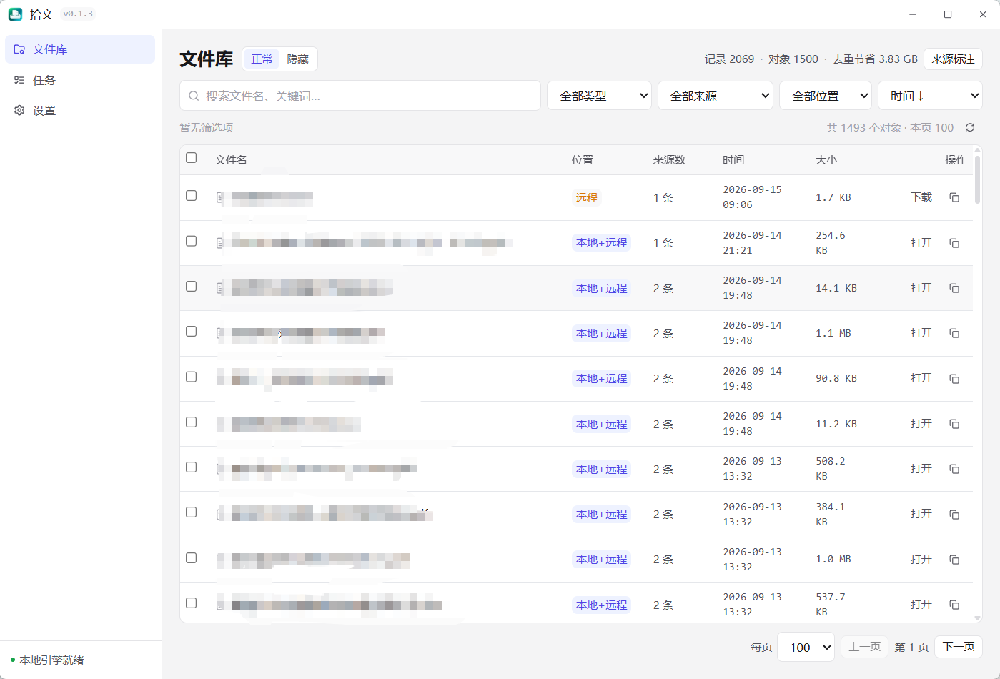
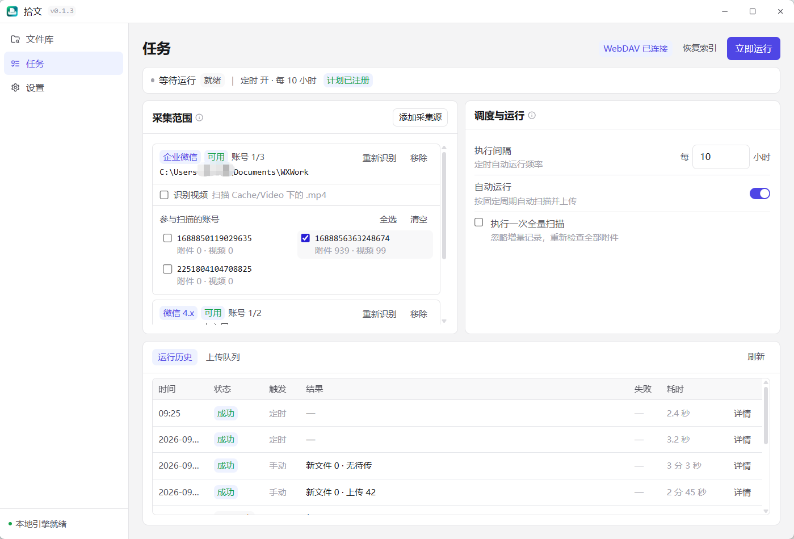
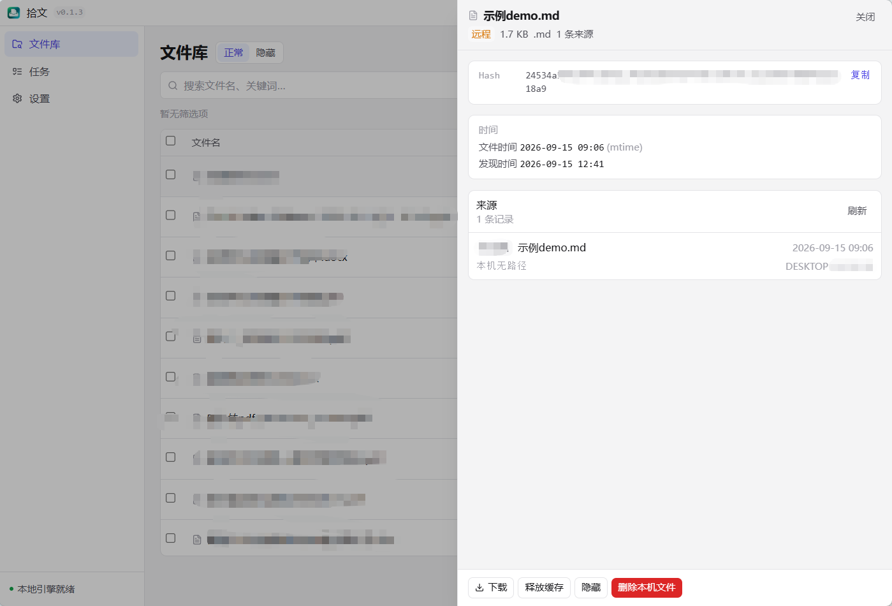
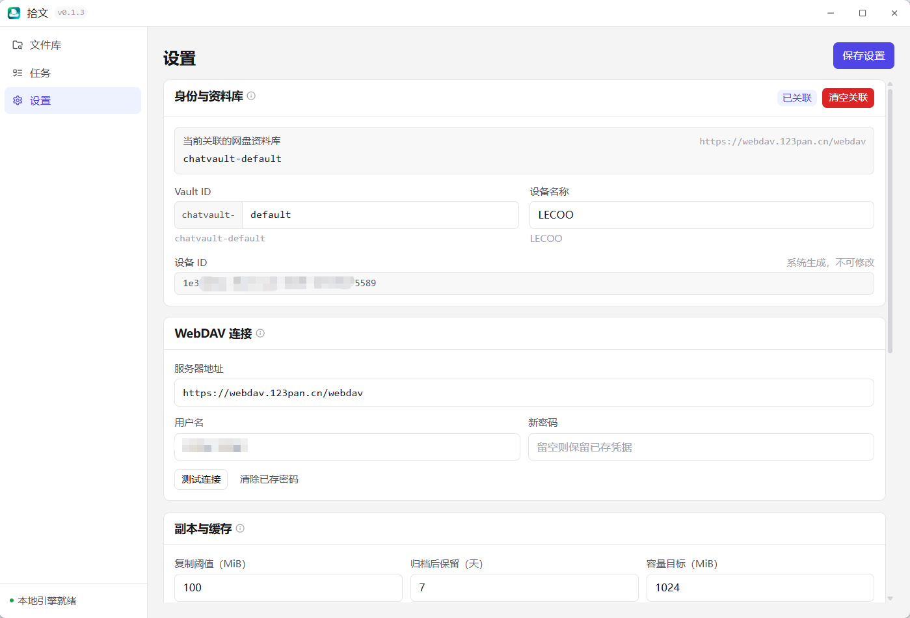

# ChatVault（拾文）

**把散落在聊天里的文件，变成找得到、存得住、带得走的个人资料库。**

方案发在哪个群？同一份资料存了几遍？换电脑后，旧附件怎么找？

拾文将 **微信、企业微信和本地文件夹** 中的附件汇集到一个桌面文件库：统一搜索、按内容去重、定时归档到你自己的 WebDAV。日常找资料，在本地完成；更换电脑，恢复索引后按需取回文件。

[下载与发行说明](https://github.com/LLMxPM/ChatVault/releases) · [快速上手](#快速上手) · [安装指南](docs/Windows安装与发布.md) · [反馈问题](https://github.com/LLMxPM/ChatVault/issues)

*文件库实拍：文件在哪里、来自几处、是否已归档，一眼可见。*

## 为什么用拾文

| 特点 | 带来的改变 |
| --- | --- |
| **一个入口，找齐资料** | 微信、企业微信和本地目录统一检索，按文件名、类型、日期与来源组合筛选，减少来回翻聊天和目录。 |
| **相同内容，只归档一份** | 按文件内容哈希去重，同一文件的多个来源仍保留；列表合并展示，节省归档空间。 |
| **设好计划，自动归档** | 自选采集目录、账号和执行周期，自动完成增量扫描、上传与同步；运行历史和异常原因可追踪。 |
| **本地搜索，离线可用** | 索引保存在本机，不连接 WebDAV 也能建立和检索文件库，本地可用的文件可直接打开。 |
| **存到自己的 WebDAV** | 使用自己的 WebDAV 网盘或 NAS 服务归档附件与元数据，存储位置和资料库由自己选择。 |
| **换台电脑，继续查找** | 连接同一资料库，先恢复索引即可搜索；需要哪个文件再下载哪个，无需先拉回全部附件。 |

归档过程包含内容校验与失败重试，完整校验通过后才显示“已校验”。文件库支持打开、定位、批量下载、缓存释放和隐藏；需要回看来源时，可展开同一文件的全部来源记录。

## 软件截图

### 一次配置，按计划收集

在任务页选择采集源和参与扫描的账号，设置执行间隔。手动运行与定时采集使用同一套流程，结果可在运行历史和上传队列中查看；“本地缺失”的上传项支持删除。

### 合并重复文件，保留来源线索

同一份文件可以来自多个目录或设备。详情侧栏集中展示来源记录、文件时间、发现时间和内容哈希，便于判断文件从哪里来，并下载或管理本地副本。

### 自己的存储，自己的资料库

连接 WebDAV 后，文件与元数据归档到指定资料库；还可以配置本地副本的大小阈值、归档后保留天数和缓存容量目标，在取用便利与本地空间之间作出选择。

## 快速上手

1. **安装并添加采集源**：从 [Releases](https://github.com/LLMxPM/ChatVault/releases) 获取 Windows x64 安装包，打开「任务」→「添加采集源」，选择微信、企业微信或本地文件夹，勾选需要采集的账号。
2. **按需连接 WebDAV**：在「设置」填写服务器地址、用户名和密码，测试连接并保存。不配置 WebDAV 也可以先使用本地文件库。
3. **立即运行，开始检索**：在「任务」点击「立即运行」，扫描后到「文件库」查找文件。启用「自动运行」并设置周期，即可按计划采集；已连接 WebDAV 时会继续上传与同步。

换电脑时，在新设备连接同一 WebDAV 和资料库，在「任务」点击「恢复索引」，即可查找已归档资料并按需下载。详细操作见 [Windows 安装与发布](docs/Windows安装与发布.md)。

## 支持范围

| 项目 | 当前支持 |
| --- | --- |
| 桌面平台 | Windows x64；macOS 后续适配 |
| 微信 | Windows 微信 4.x 附件与视频 |
| 企业微信 | Windows 企业微信 Cache 文件与视频 |
| 其他来源 | 用户指定的本地文件夹 |
| 远端存储 | WebDAV，支持归档、元数据同步与索引恢复 |
| 安装与更新 | NSIS 当前用户安装；设置 → 关于可手动检查更新并下载安装 |

采集以本机目录中实际存在且可访问的文件为基础。视频采集可按来源开启；本地搜索针对文件名及索引字段。

本地数据默认位于 `%LOCALAPPDATA%\com.chatvault.desktop\`，包括索引、附件副本和日志；卸载默认保留资料，可选清理应用数据。当前安装包尚未配置代码签名，ARM64 和 macOS 分发不在当前范围。

## 开发与文档

桌面端采用 **Tauri 2 + Vue 3 + TypeScript**，核心由 **Rust** 实现，使用 **SQLite + FTS5** 构建本地索引、**BLAKE3** 标识文件内容。前端使用 pnpm，Rust 使用 Cargo workspace。

| 文档 | 说明 |
| --- | --- |
| [产品与实施规划](docs/产品与实施规划.md) | 定位、功能范围、阶段与验收 |
| [架构与同步设计](docs/架构与同步设计.md) | 模块、数据模型、WebDAV 与同步 |
| [开发与构建](docs/开发与构建.md) | 依赖、命令、构建与 CI |
| [Windows 安装与发布](docs/Windows安装与发布.md) | 打包、数据位置、卸载与发布边界 |

功能规格见 `docs/compose/spec/`。仓库结构、协作与验证约束见 [AGENTS.md](AGENTS.md)。

## 开源许可

本项目以 [GNU Affero General Public License v3.0 or later](LICENSE)（AGPL-3.0-or-later）发布。

你可以自由使用、修改和分发本软件；若通过网络向用户提供本软件或基于本软件的服务，须向用户提供对应源代码。完整条款见仓库根目录 [LICENSE](LICENSE) 文件。

Copyright (C) 2026 ChatVault Team / LLMxPM
