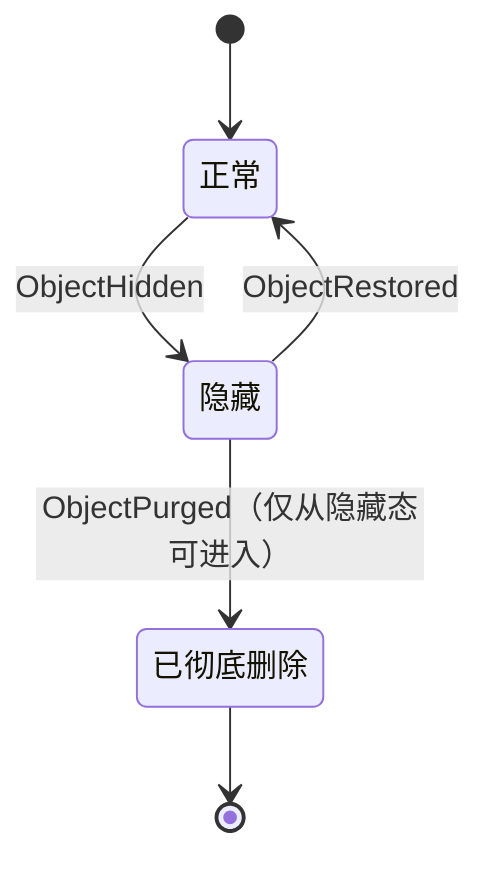

# 文件库隐藏、恢复与彻底删除（多端同步）

本文是文件库隐藏/删除能力的结论性契约。开发阶段不留兼容层，直接按本文实现。

与既有契约关系：

- 对象折叠列表、位置徽章、打开/定位/下载、批量导出/释放缓存/删除本机原文件继续有效（见 `library-enhance.md`、`library-open-status-dedup-download.md`）。
- 既有 `FileRecordDeleted` + `record_tombstones` 是**记录级**软删除底座，本轮保留其协议与应用逻辑，但**文件库 UI 的主路径改为对象级**隐藏/恢复/彻底删除。
- 「删除本机原文件」仍是本机磁盘操作，不写 journal、不同步；与本功能正交。

本轮**不做**：记录级隐藏入口、跨对象批量 purge 的自动远程 GC 扫描、隐藏原因备注、回收站自动过期。

---

## 1. 产品语义

### 1.1 三态可见性（对象级）

文件库列表按内容对象折叠。用户操作的是 **object**，不是单条来源记录。

| 状态 | 含义 | 默认列表 | 可恢复 | 远端内容 | 本机原文件 |
| --- | --- | --- | --- | --- | --- |
| 正常 | 默认可见 | 显示 | — | 按备份进度保留 | 不动 |
| 隐藏 | 软隐藏，可反悔 | 不显示 | 可以 | 不删除 | 不动 |
| 已彻底删除 | 本地索引移除 + 远端对象删除 | 不显示 | 不可以 | 发起端删除 | 不动 |

状态迁移：



约束：

1. **删除只能发生在隐藏之后**：正常对象必须先隐藏，才能在隐藏列表里彻底删除。
2. **恢复不要求重建本机关联**：恢复只恢复元数据可见性与 FTS；若 `local_files` 已缺失或路径失效，位置徽章显示 remote/missing，可再下载。
3. **隐藏不中断备份**：已排队/重试中的上传继续执行；隐藏只影响列表与检索默认结果。
4. **彻底删除会取消该对象未完成上传任务**，并清理受控缓存副本；**不删除**微信/采集目录原文件。
5. **允许同内容重新入库**：purge 后若源文件仍在，下次扫描可作为新 `record_id` 再次入库并重新备份。不做永久内容黑名单。

### 1.2 与「删除本机原文件」区分

| 操作 | 作用范围 | 是否同步 | 是否可恢复 |
| --- | --- | --- | --- |
| 隐藏 / 恢复 / 彻底删除 | 归档库可见性与远端内容 | 是 | 隐藏可恢复 |
| 删除本机原文件 | 磁盘 `original_path` + 本地映射 | 否 | 否（文件已删） |
| 释放本机缓存 | 受控 `cache_path` | 否 | 可再下载 |

---

## 2. 数据模型与事件

### 2.1 本地表（直接新建，无迁移兼容层）

```sql
-- 对象可见性（仅 hidden 持久化；无行 = 正常）
-- 不设外键：隐藏事件可能先于 FileRecordAdded 到达
CREATE TABLE IF NOT EXISTS object_hidden (
    object_id TEXT PRIMARY KEY,
    hidden_at TEXT NOT NULL,
    event_id TEXT NOT NULL,
    logical_clock INTEGER NOT NULL,
    device_id TEXT NOT NULL
);

-- 彻底删除标记：用于多端应用与重放；新 FileRecordAdded/ingest 会清除该标记以允许重新入库
CREATE TABLE IF NOT EXISTS object_purges (
    object_id TEXT PRIMARY KEY,
    event_id TEXT NOT NULL,
    logical_clock INTEGER NOT NULL,
    device_id TEXT NOT NULL,
    purged_at TEXT NOT NULL
);
```

说明：

- 无 `object_hidden` 行且无 `object_purges` 行 = 正常可见。
- `object_purges` 在本机 hard-delete 相关 `file_records`/`local_files`/`upload_tasks`/FTS 后仍保留一行，保证：
  - 重放完整 journal 时（Added → Purged）最终为空；
  - 后设备的 `ObjectPurged` 应用幂等；
  - 更晚到达的 hide/restore 为 no-op。
- **同内容允许重新入库**：`ingest_file` 或 `FileRecordAdded` 写入新 record 时删除该 object 的 `object_purges` 行，对象重新可见并可再次备份。

### 2.2 Journal 事件类型

扩展 `JournalEventType`：

| 事件 | payload 必填 | 语义 |
| --- | --- | --- |
| `ObjectHidden` | `object_id` | 对象进入隐藏 |
| `ObjectRestored` | `object_id` | 对象恢复可见 |
| `ObjectPurged` | `object_id` | 彻底删除（必须先处于 hidden；并发下若未 hidden 也允许执行，视为已隐含隐藏后删除） |

冲突与优先级（沿用 §6 Lamport + device_id + event_id）：

1. 同一 object 上，**较高** `logical_clock` 的 hide/restore 覆盖较低者；相等时按 `device_id`、`event_id` 确定性排序。
2. `ObjectPurged` **永久压过**同 object 的 hide/restore；已 purge 后到达的 hide/restore 为 no-op。
3. Purge 之后到达的、**新的** `FileRecordAdded`（新 record_id）使对象重新可见——符合「允许重新入库」。
4. 既有记录级 `FileRecordDeleted` 继续可用；对象隐藏不等于逐条 FileRecordDeleted。对象折叠查询只要 object 为 hidden 或已 purge，即使仍有未 tombstone 的 records 也不在默认列表出现（purge 时 records 已删）。

事件校验（`validation.rs`）：

- 三者均 `require_string(object_id)`，并校验 `object_id` 形如 `blake3:<hash>` 且 hash 合法。
- `ObjectPurged` 不要求远端对象仍存在（发起端可能已先删）。

### 2.3 查询口径

`SearchFilter` 新增：

```rust
/// 是否包含已隐藏对象；默认 false。
/// true 时仅返回 hidden，用于「隐藏文件」视图。
/// 彻底删除的对象永不返回。
pub hidden: bool, // 或 visibility: Option<VisibilityFilter> enum Visible|Hidden
```

实现要点：

- 默认列表：`NOT EXISTS object_hidden`（且 object 下仍有未被 record tombstone 全灭的可用代表行——沿用现折叠逻辑）。
- 隐藏列表：`EXISTS object_hidden`，代表行/名称/位置徽章沿用现规则；`local_files` 可缺失。
- 全部查询继续排除 `record_tombstones` 已删 records。
- FTS：object 隐藏时，从 `file_search_fts` **移除该 object 下全部 record 的行**；恢复时按现存非 tombstone records 重建 FTS。避免默认搜索搜到隐藏项。

---

## 3. 领域操作（Index API）

放在 `crates/index`，与 `update_source_account` 同构：同一事务内改状态 + 写 journal。

### 3.1 `hide_object(device_id, object_id)`

前置：object 存在；未 purge；若已 hidden 则幂等成功（可不重复写事件，或写事件但 apply 幂等——**推荐幂等短路，不重复写事件**）。

步骤：

1. UPSERT `object_hidden`。
2. 删除该 object 下全部非 tombstone records 的 FTS 行。
3. 追加 `ObjectHidden` journal 事件。

不改：`upload_tasks`、`local_files`、远端、原文件。

### 3.2 `restore_object(device_id, object_id)`

前置：object 存在；当前 hidden；未 purge。未 hidden 时幂等成功。

步骤：

1. DELETE `object_hidden`。
2. 为现存非 tombstone records 重建 FTS。
3. 追加 `ObjectRestored`。

不强制恢复 `local_files` 关联。

### 3.3 `purge_object(device_id, object_id)`

前置：object 存在；**必须 hidden**；未 purge。未 hidden → 业务错误「请先隐藏」。

步骤（单事务）：

1. 取消该 object 全部 `upload_tasks`（置 `cancelled`，或直接 DELETE；**推荐置 cancelled 保留审计**）。
2. 删除该 object 下 `file_search_fts`、`local_files`、`file_records`（records 级联因外键或显式删）。
3. 若删 records 后无其它引用且无上传依赖，可删除 `file_objects` 行；**为简化同步重放，推荐保留 `file_objects` 行 + 写 `object_purges`**，列表层过滤 purge。  
   - 若 hard-delete `file_objects`，远端 `FileRecordAdded` 重放会重新插入 object——仍可接受，但 purge 标记更清晰。  
   - **定案：保留 `file_objects`，写 `object_purges`，查询排除已 purge object。**
4. DELETE `object_hidden`。
5. UPSERT `object_purges`。
6. 追加 `ObjectPurged` journal 事件。

返回：`hash`、`size`、是否曾有远端归档（是否有 `backed_up` 任务），供命令层决定远程 DELETE。

### 3.4 远程对象删除（Sync/WebDAV）

发起 purge 的设备在 **本地事务成功并进入发布路径后**（或 purge 后立即、失败可重试）：

1. 读 object `hash` → `get_object_path(vault_id, hash)`。
2. WebDAV `DELETE`；404 视为成功。
3. 远程失败：purge 逻辑状态仍已提交（多端先一致隐藏列表），命令返回「索引已删除，远端清理失败：…」，可对残留对象后续重试或由设置提供「清理已 purge 远端残留」二期再做。  
   - **V1 策略：purge 命令同步尝试远程删除；失败不回滚本地 journal/索引，错误透出。**

注意：内容寻址对象可能曾被其它 records 共享；purge 语义是「这个 library object 不要了」。同 hash 若之后重新入库，会重新上传同一路径。

不删除：`objects/` 下其它对象、`journal/`、`commits/`、`devices/`。日志保留是多端一致与审计基础。

### 3.5 应用远端事件（`events.rs` / `apply.rs`）

| 事件 | apply 行为 |
| --- | --- |
| `ObjectHidden` | UPSERT `object_hidden`；删该 object FTS；不删 records |
| `ObjectRestored` | 若无更晚 purge：DELETE `object_hidden`；重建 FTS |
| `ObjectPurged` | 取消 tasks；删该 object 当前 records/local_files/FTS；DELETE hidden；UPSERT `object_purges` |

`apply_file_record_added_event`：若 object 已存在 `object_purges`，**仍允许插入新 record**（重新入库）；插入后 object 自然回到可见（无 hidden 行）。若同时存在 `object_hidden`（异常：purge 后又 hide，或时序），新 record 在 hidden object 下应不可见——insert 时不写 FTS。

---

## 4. 桌面命令与前端

### 4.1 Tauri 命令

| 命令 | 参数 | 说明 |
| --- | --- | --- |
| `library_hide_objects` | `objectIds: string[]` | 批量隐藏；逐个调用 index；汇总成功/失败 |
| `library_restore_objects` | `objectIds: string[]` | 批量恢复 |
| `library_purge_objects` | `objectIds: string[]` | 批量彻底删除；**要求均已隐藏**；逐个：本地 purge → 尝试远程 DELETE |

批量结果 DTO 复用现有 `BatchResultDto` 模式。

未绑定 WebDAV 时：隐藏/恢复仍可本地生效；purge 删除本地索引并提示「未绑定远端，仅删除本机库记录」。

### 4.2 查询 API

`search_objects` 查询条件增加 `hidden`（或 `visibility`）。默认 `false`。

`get_vault_stats` 可增补 `hiddenCount`（可选，非阻断）。

### 4.3 UI（LibraryView + LibraryDetailPanel + 批量栏）

1. **视图切换**：列表上方增加「正常 / 隐藏」分段或 tab；默认正常。
2. **行操作 / 详情操作**：
   - 正常视图：「隐藏」（危险色偏弱，二次确认轻量：说明可恢复、不影响备份与原文件）。
   - 隐藏视图：「恢复」「彻底删除」（危险，强确认）。
3. **批量栏**：
   - 正常视图选中 → 批量隐藏。
   - 隐藏视图选中 → 批量恢复 / 批量彻底删除。
4. **彻底删除确认文案**必须写明：
   - 仅允许对已隐藏对象操作；
   - 将删除本机库记录并尝试删除网盘归档；
   - 不会删除微信/电脑上的原文件；
   - 源文件仍在时下次扫描可能重新入库；
   - 不可恢复。
5. 隐藏视图列表徽章：仍显示 local/remote/both/missing；「恢复」后按当前位置展示。
6. 操作成功后刷新当前视图；详情抽屉若 object 已不在当前结果则关闭。

---

## 5. 同步发布与恢复

- 三事件走现有 journal 发布流水线，**无需改 commit 格式**。
- `verify_references`：新事件类型无对象字节校验；仅 `validate_event`。
- `restore_from_remote`：完整重放后，凡以 `ObjectPurged` 结尾的对象应无可见 records；凡以 `ObjectHidden` 结尾的对象在隐藏视图可见。
- 新设备换机恢复：先快照（若使用）再日志；hidden/purge 状态随事件重建，不依赖本机曾有 `local_files`。

---

## 6. 测试计划

### 6.1 Index

1. hide 后默认 `search_objects` 不含该 object；`hidden=true` 含。
2. hide 幂等；restore 后回到默认列表且 FTS 可搜。
3. restore 在无 `local_files` 时成功，位置为 remote/missing。
4. 未 hidden 时 purge 失败；hidden 后 purge：records/tasks/FTS 清空，`object_purges` 有行，默认与隐藏列表均不含。
5. purge 后同 path 重新 `ingest_file` 产生新 record，对象重新可见。
6. 远端事件乱序：Hidden 后 Restore 再 Purged；Purged 后到达的旧 Hide/Restore 为 no-op。
7. 多来源同 object：hide/purge 一次覆盖全部 sources。

### 6.2 Sync

1. 设备 A hide → 发布 → B pull 后 B 默认列表隐藏。
2. A restore → B 可见。
3. A purge（含模拟远程 DELETE）→ B pull 后索引清除；B 上仍存在的源文件可再 ingest。
4. 全量 restore_from_remote 重放与在线 pull 终态一致。

### 6.3 前端/命令

1. 批量隐藏/恢复/部分失败汇总。
2. purge 未隐藏对象被拒绝。
3. 未绑定 WebDAV 时 purge 提示仅本机。

---

## 7. 实施步骤

| 顺序 | 工作项 | 主要落点 |
| --- | --- | --- |
| 1 | 事件类型、schema、validation | `core/models.rs`, `index/schema.rs`, `sync/validation.rs` |
| 2 | hide/restore/purge + apply | `index/visibility.rs`（新）, `index/events.rs`, `index/query.rs`, `sync/apply.rs` |
| 3 | 远程 DELETE 编排 | `index` 返回 hash 信息；`commands/library.rs` 调 WebDAV |
| 4 | Tauri 命令 + `tauri.ts` | `commands/library.rs`, `main.rs`, `api/tauri.ts` |
| 5 | UI 视图切换与操作 | `LibraryView.vue`, `LibraryDetailPanel.vue` |
| 6 | 测试与文档 | `index/tests`, `sync/tests`, 更新 `架构与同步设计.md` §6/§7、本文 status→implemented |

建议拆分 PR/提交：先领域+同步可测，再桌面 UI。

---

## 8. 明确边界

- 不删除用户微信/采集目录原文件。
- 不删除 journal/commits 历史；purge 是内容对象与索引记录的删除。
- 不实现「隐藏原因」「定时清空回收站」「记录级隐藏」。
- 允许 purge 后同内容再入库，不做 hash 级永久拉黑。
- 开发期直接按新表结构建库，不做历史库迁移。
