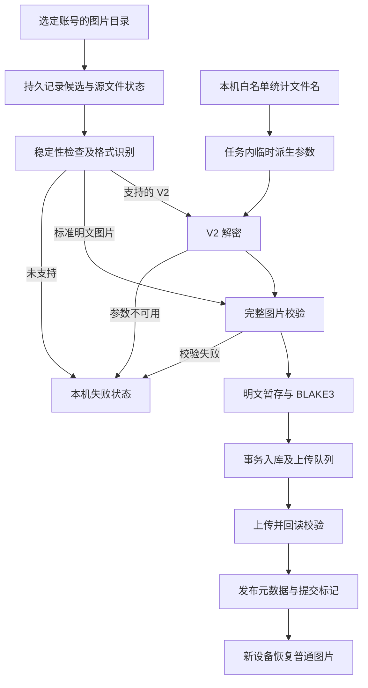
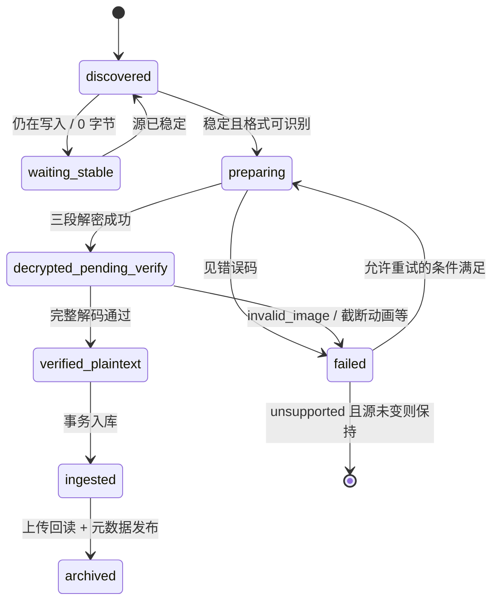
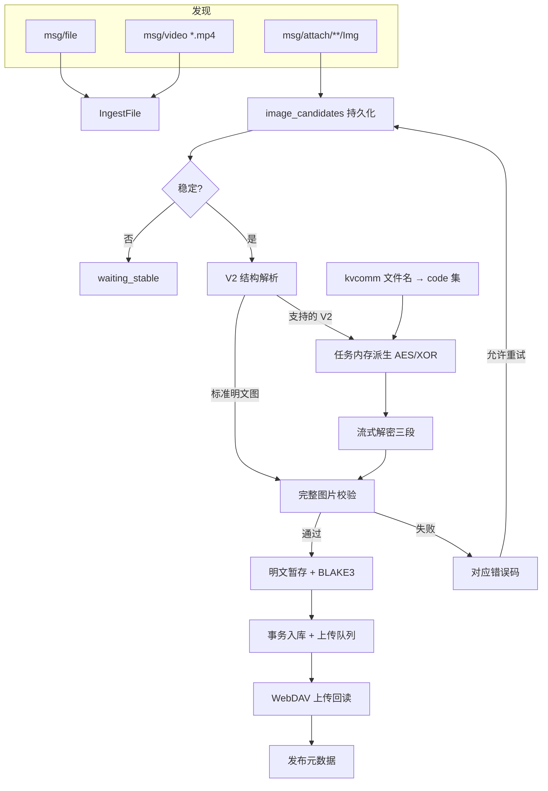

# 微信 4.x 媒体备份完整方案（视频 + 聊天图片）

本文是微信 4.x 媒体备份的唯一实施设计：范围、参数、失败态、重试、数据契约与实施顺序。业务代码已按 M1–M3 落地（视频扫描、图片解密准备、候选持久化与入库）。

## 1. 目标与边界

### 1.1 目标

在现有 `msg/file` 文档附件之外，补上两块高价值媒体：

1. **视频本体**：`msg/video/**/*.mp4`，明文直接采集。
2. **聊天图片**：`msg/attach/**/Img/*`，在本机离线解密并校验后，备份可独立打开的明文图片。

验收核心：新设备没有微信、没有密钥、没有本机参数目录时，能从 Vault 恢复已成功备份的视频与标准图片。

视频与图片可按 M1/M2 分期实现；视频不阻塞图片研发，图片失败不阻塞视频。

### 1.2 硬约束（全程不变）

- **不访问微信进程内存**：不做内存扫描、转储、调试附加、注入、Hook；不调用具备这些行为的外部工具。
- **不解密聊天数据库**：不读 `db_storage`、消息表、`hardlink.db` 换会话名或定位。
- **不保存、不上传密钥**：AES 密钥、XOR 参数、code、含 code 的统计文件名不得进入 SQLite、配置、日志、诊断包、同步日志、快照、WebDAV、前端 DTO、命令行参数、环境变量。任务内存内派生与使用，结束时释放并尽力清零。也不读取第三方工具已有的密钥缓存。
- **不以密文充数**：解密失败不把 `.dat` 原样当图片归档；不改写或删除微信原文件。
- **参数只读文件名白名单**：`%APPDATA%/Tencent/xwechat/{net,ilink}/kvcomm` 下符合命名的文件名；不读 MMKV 正文，不扫全盘，不读其他用户目录。

这是采用公开研究线索做文件格式解析与离线解密，仍依赖微信未公开的存储细节，不能称为官方接口，也不保证所有版本适用。取舍是限制适配范围，避免扩大到密钥破解和进程分析。

### 1.3 明确不做（首期）

- 语音、Rec / Ann / History、表情、头像、朋友圈。
- 视频封面 `.jpg`、`_thumb.jpg`。
- 仅云端存在、本地未下载或已清理的原图/原视频。
- V0 / V1 图片格式兼容链。
- WXGF 完整展示语义未验收前，不计入成功备份。
- 会话显示名的**自动**还原（从微信 `db_storage` / 联系人库反推）；用户标注映射见 §5.0，属于要做的能力。
- macOS 微信布局。
- 不引入新的 `source_type`；不把 video 拆成独立采集源配置项。
- 不修改通用目录适配器与同步协议。

---

## 2. 本机已确认的设计事实

环境基线：Windows，微信 4.1.13.12。下列结论用于约束实现与产品表述，不作为全库覆盖率承诺。

### 2.1 目录与规模

| 账号 | `msg/file` | `msg/video` | `msg/attach` | 活跃痕迹 |
| --- | --- | --- | --- | --- |
| A1（非 `wxid_`，目录带四位十六进制后缀） | 123 / ~530 MB | 1762 / ~2.2 GB | ~15k / ~2.2 GB | 附件最后写入约 2026-08-10 |
| A2（`wxid_` 形式） | 20 / ~83 MB | 24 / ~243 MB | ~786 / ~259 MB | 附件持续写入至抽样当日 |

布局：

```text
<account>/msg/file/YYYY-MM/<原文件名>
<account>/msg/video/YYYY-MM/<md5>.mp4          # 本体（目标）
                         <md5>.jpg             # 封面（不做）
                         <md5>_thumb.jpg       # 缩略图（不做）
<account>/msg/attach/<conv_hash>/YYYY-MM/Img/*  # 加密 .dat（图片目标）
```

图片路径解析约定：

- `conv_hash`：`attach` 下第一层目录名，写入 `source_conversation_id`。
- 同一会话下同一逻辑图片可能有多条文件（显示图、高清候选、缩略图），通过文件名与解密后尺寸归类。

说明：

- 视频月份目录与 `msg/file` 相同，为 `YYYY-MM`；无会话子目录；同一 hash 的 `mp4`/`jpg`/`_thumb.jpg` 同月共存。
- 存在「整月只有 `_thumb.jpg`、没有 `.mp4`」的情况：只索引实际存在的 `.mp4`，不为缩略图造记录。
- `msg/attach` 布局与 file/video 不同（会话在顶层）；加密头 `07 08 56 32`。

### 2.2 V2 图片格式

三段模型，不使用两段回退：

- 头 15 字节：签名 `07 08 56 32 08 07`，小端 u32 AES 明文长 `A`，小端 u32 XOR 尾长 `X`，标志字节（样本均为 1）。
- AES 密文长 `C = 16 × (floor(A/16) + 1)`，AES-128-ECB + 严格 PKCS#7，去填充后长度必须恰为 `A`。
- 中间原样段 `R = L - 15 - C - X`（可为空，必须 ≥ 0）。
- 产物 = 去填充 AES 明文 + 原样中间段 + XOR 还原尾段；随后用标准解码器完整校验。

派生（任务内存内）：

```text
account_id = 账号目录名，按公开规则规范化
  - wxid_* 形式：去掉末尾 _<4hex> 段（本机 A2 验证）
  - 其他形式：仅当末尾恰为 _<4hex> 时可尝试去后缀；否则保持完整目录名
AES key  = MD5( decimal(code) || account_id ) 的小写 hex 文本前 16 个 ASCII 字节
XOR byte = code & 0xff
```

MD5 仅用于匹配微信格式；ChatVault 内容寻址仍使用 BLAKE3。派生关系不证明任意统计文件都属于当前账号。

### 2.3 统计参数存储

| 项目 | 结论 |
| --- | --- |
| 位置 | `%APPDATA%\Tencent\xwechat\net\kvcomm\`，白名单另含 `ilink\kvcomm\` |
| 有效形态 | 文件名 `key_<code>_....statistic`，**code 取自文件名数字** |
| 文件正文 | MMKV 风格统计容器，**不是** AES 密钥；本方案不读正文 |
| 本机现状（登录 A1 后） | 白名单内可同时存在：A1 会话 code（大量 `key_*`）、A2 残留 code、退出残留 code=`0` |
| 账号关联线索 | `MD5(code+id)[:4]` 对目录后缀：A2 旧 code 命中，A1 新 code 不命中；**不能当作独立认证** |

### 2.4 解密可行性结论

| 账号 | 外层解密 | 标准图完整解码 | WXGF 诊断 | 参数 |
| --- | --- | ---: | ---: | --- |
| A1（登录 A2 期间） | 结构可解析，参数未命中 | 0 | 0 | 无可用 code |
| A1（登录 A1 后） | 近期样本全部外层成功 | JPEG/PNG 可解出 | WXGF 首块可识别 | 该会话 code + 去四位十六进制后缀 |
| A2 | 全部样本通过 | 多数 JPEG/PNG | 可标准 HEVC 出像素，展示语义未过 | `wxid` 清洗；登录其他账号后残留仍可用 |

A1 占图片候选约 95%。**参数可用性按账号、按会话时段隔离**；同目录可同时残留多账号 code。登录目标账号是当前实测有效的参数生成路径，不得写成对全部历史文件的保证，也不得把单账号成功外推为全库能力。

### 2.5 登录 / 退出与参数行为

| 观察 | 结论 |
| --- | --- |
| 微信运行中（会话 A2） | 仅 A2 的 `login\...\key_info.dat` 与进程启动同秒刷新 |
| 用户退出微信后 | 进程消失；**`key_*.statistic` 文件未被删除** |
| 退出时刻 | 新写入 code=`0` 的统计文件；`last_uin` 清空 |
| 退出后离线解密 | **A2 仍可用残留 code 成功解密**（含 JPEG/PNG/WXGF 首块） |
| A1（当时） | 无可用参数 |
| 用户登录 A1 后 | 对应 `login\*\key_info.dat` 刷新；出现 A1 的新 code；**A1 历史样本首块可命中**；A2 旧 code 仍可用 |
| 再登录 A2（双账号） | 两个 `login\*\key_info.dat` 均近期刷新；多账号 code 共存，**A1、A2 样本均可解** |

**结论修正：**

1. 「未登录 ⇒ 必然无法解析」**不成立**。残留 `key_*.statistic` 在退出后仍可离线派生。
2. 「某账号无法解析」直接原因往往是**该时段白名单内没有该账号的 code**；登录后新 code 生成，历史文件即可尝试解开。
3. 退出会停止刷新会话参数并写入 code=0，但**不擦除**历史 `key_*`；多账号残留可同时共存并各自有效。
4. `MD5(code+id)[:4]` **不可靠**，只作诊断线索，不参与授权判断。
5. 实现必须对「本机 code 集合 × 账号标识变体」做有限交叉验证，不能假定单一当前账号 code。
6. 产品：每次任务重新探测参数；参数不可用时提示登录对应账号后重试，**不**承诺登录后必能解开全部历史图，**不**依赖进程存活，**不**承诺退出后参数一定还在。

---

## 3. 采集范围总表

| 输入 | 行为 | 成功定义 |
| --- | --- | --- |
| `msg/video/**/*.mp4`（非 0 字节） | 直接发现入库 | 对象哈希 + 元数据发布；打开为可播放 mp4 |
| `msg/video` 下 jpg / thumb / 其他 | 跳过 | 不造记录 |
| 明文 JPEG/PNG/GIF/WebP（含另存到通用目录） | 校验后按普通文件/图片路径备份；不读微信参数 | 完整解码通过 |
| 已验证 V2 → 标准图 | 本机解密 → 完整校验 → 明文对象；写入 `conv_hash` 会话与变体类型 | 完整解码 + 明文 BLAKE3；同图多变体均可备份 |
| 已验证 V2 → WXGF | 外层可解密，完整导出未过验收前 **不算成功** | 状态 `unsupported_payload`，可附诊断计数 |
| V0 / V1 / 未知 `.dat` | 明确未支持 | 状态可区分，不反复重解密 |
| 0 字节、写入中、损坏 | 等待稳定 / 校验失败 | 不入库 |
| 仅云端、本地缺失 | 不宣称已备份 | 统计中不计入成功 |

来源语义：

- 采集源仍为 `wechat-windows-4`，用户配置路径仍是 `xwechat_files` 根目录；账号发现仍要求存在 `msg/`。
- 视频：`source_conversation_id = None`；不把月份目录伪造成会话 ID；`file_name` 使用磁盘原名（hash.mp4）。
- 图片：`source_conversation_id` **写入路径上的 `conv_hash`**（`msg/attach/<conv_hash>/...` 的会话目录名）。这是本机不透明会话标识，用于筛选、分组和后续人工标注，**不是**已还原的聊天标题，也不读 `db_storage` 反推联系人。
- 文件时间来自源 mtime，注明 `time_source=mtime`，不伪装成消息发送时间。
- 同一图片组的显示图 / 高清候选 / 缩略图均纳入处理；按明文字节 BLAKE3 去重，相同内容复用对象，不同分辨率或编码保留独立对象与来源。

---

## 4. 视频采集设计

### 4.1 现状契约（保持不变）

- `msg/file` 行为保持：`YYYY-MM/<原名>` 平铺；可选 `YYYY-MM/<conversation_id>/<file>`；深度 1 月份 mtime 裁剪；0 字节跳过。

### 4.2 目标行为

1. **多媒体根扫描**  
   `WeChatAccount` 在现有 `files_dir`（`msg/file`）之外增加 `video_dir`（`msg/video`）。扫描编排层对每个账号依次处理这两个媒体根，各自独立检查点。缺失 `msg/video` 时按空扫描处理。

2. **视频解析规则**  
   - 仅扩展名为 `.mp4`（大小写不敏感）的普通文件进入 `DiscoveredFile`。  
   - 跳过 `.jpg`、`_thumb.jpg` 及其他非 mp4。  
   - 跳过 0 字节（与 file 策略一致）。  
   - `source_type` 仍为 `wechat-windows-4`；`source_account_id` 为账号目录名。  
   - `source_conversation_id` 恒为 `None`。  
   - `file_name` 使用磁盘上的原文件名；`original_path` 为绝对路径。

3. **增量策略**  
   复用 `MtimeAtDepthStrategy::new(1)`：以 `msg/video` 为扫描根，深度 1 的月份目录 mtime 裁剪。全量扫描时两个媒体根均完整遍历。

4. **检查点**  
   `scan_roots` 以每个媒体根的绝对路径为键（`...\msg\file` 与 `...\msg\video`），互不覆盖。未完成候选时保留原检查点。

5. **账号统计 DTO**  
   `WechatAccountDto.files_count_estimated` 拆分为 file / video / image 候选计数，避免用户误判视频已采集。

6. **文档同步**  
   实现完成后更新 `架构与同步设计.md` 增量扫描与媒体根说明；布局结论以本文为准。

---

## 5. 聊天图片解密备份设计

路径：授权目录发现图片 → 本机离线派生参数并解密 → 校验完整图片 → 明文内容对象入库 → WebDAV 归档。远端保存可独立打开的图片，恢复端不需要微信、微信账号密钥或本机派生材料。

首期目标布局为账号下 `msg/attach/<conv_hash>/<YYYY-MM>/Img/`。只枚举这一结构中的普通文件；扩展名仅筛选候选，是否可备份由字节格式和完整解码决定。严格限制在用户选中的账号根内，不跟随符号链接或目录联接越界。

首期不扫描朋友圈、头像、表情、`cache/Message`、`Rec`、`Ann`、`History`。

### 5.0 会话 ID 与同图多变体

#### 会话 ID 与显示名映射

| 项 | 约定 |
| --- | --- |
| 取值 | 路径 `msg/attach/<conv_hash>/YYYY-MM/Img/<file>` 中的 `conv_hash` |
| 写入 | `FileRecord.source_conversation_id = conv_hash` |
| 来源映射 | 入库时 `ensure_source_conversation`：`source_type + source_account_id + source_conversation_id`；`source_name` 先写 `conv_hash` |
| **显示名映射（要做）** | 复用现有前台「来源标注」：用户为该会话设置 `display_name` / 收藏；列表与筛选显示 `effective_name = display_name → source_name → source_conversation_id` |
| 同步 | `SourceConversationUpdated` 事件已走日志同步；标注结果多设备一致 |
| 筛选 | 文件库按会话筛选；同一 `conv_hash` 下显示图/高清/缩略图归同一会话 |
| 不做自动还原 | 不读 `db_storage` 反推联系人/群名；不把 `conv_hash` 宣称为微信官方 chat id |

前台能力（已存在，媒体接入后即可用）：

- 文件库「来源标注」面板：左侧账号、右侧会话，可改显示名与收藏（`SourceLabelPanel`）。
- 命令：`list_source_conversations` / `update_source_conversation`。
- 文件列表 `source_conversation_name` 已按上述回退链展示；用户改名后立即生效。

图片入库只要写入 `source_conversation_id = conv_hash`，会话就会自动出现在标注列表中，无需再为媒体单独做一套改名 UI。

`conv_hash` 为空或路径不符合 `attach/<dir>/<YYYY-MM>/Img` 时，`source_conversation_id` 保持空并记诊断计数，不猜测。

#### 同图多变体（显示图 / 高清候选 / 缩略图）

同一逻辑聊天图片可能对应多个本地文件。实现必须识别并处理变体，而不是只备份其中一个或全部当无关文件。

**1. 变体识别（两级，可并用）**

| 级别 | 方法 | 结果 |
| --- | --- | --- |
| 文件名 | 源 stem / 后缀启发式（如含 `thumb`、`hd`、尺寸标记、同 stem 不同扩展） | 优先 `thumbnail` / `high` / `display` |
| 解密后尺寸 | 完整校验得到 `image_width × image_height` 与字节数 | 同组内最大边/像素优先判 `high` 或 `display`；明显小图判 `thumbnail`；无法区分则 `unknown` |

文件名与尺寸冲突时：以解密后的实际尺寸与完整解码结果为准，文件名仅作辅助；两者都不确定则 `unknown`，仍备份，不丢弃。

**2. 分组键 `image_group_key`**

```text
image_group_key = blake3(
  source_type || source_account_id || conv_hash || YYYY-MM || normalized_stem
)
```

- `normalized_stem`：去掉已知变体后缀（如 `_thumb`、`_hd`、`_display` 及纯尺寸标记）后的源文件名主干。
- 同组内可有多条记录；对象仍按**明文 BLAKE3** 去重，内容相同只存一个对象。
- 分组只影响展示与统计，**不**把缩略图与原图合成一个对象，**不**用分组键代替内容哈希。

**3. 入库与打开策略**

| 场景 | 行为 |
| --- | --- |
| 组内全部通过校验 | 全部备份：各自 `FileRecord` + `media_variant`；相同明文复用对象 |
| 组内部分失败 | 成功的正常备份；失败的进候选重试；组不因单变体失败而整组丢弃 |
| 列表展示 | 默认可按 `image_group_key` 折叠一行，展开列出 display/high/thumbnail |
| 「打开」 | 组内优先级：`high` → `display` → `thumbnail` → `unknown` 中像素最大者 |
| 「下载/导出」 | 默认导出选定变体；可选「导出全部变体」按变体后缀区分文件名 |
| 统计 | 发现/已备份按文件计；另报「逻辑图片组数」，避免把 3 个变体算成 3 张图 |

**4. 明确不做**

- 不因存在高清就删除或不备份缩略图。
- 不把不同内容的同名文件强行并组（分组键含会话与月份，对象仍看内容哈希）。
- 不用变体关系推断消息 ID 或发送时间。

### 5.1 参数来源与生命周期

- 用户为选定微信采集源启用图片解密时，界面说明将额外读取当前 Windows 用户的微信统计文件名；该开关及允许的根目录仅本机保存。图片读取失败不影响已有 `msg/file` 的归档。
- 首期白名单为 `%APPDATA%/Tencent/xwechat/net/kvcomm` 和 `%APPDATA%/Tencent/xwechat/ilink/kvcomm`，只枚举符合命名规则的文件名，不读取 MMKV 文件内容。
- 不扫描其他 Windows 用户目录，不搜索全盘，不访问旧版微信目录作为兜底；重定向位置需显式配置为本机参数目录并通过范围校验。
- 账号目录存在附加后缀时，仅使用已获样本证明的规范化规则；无法确定时返回账号标识未确认，不尝试排列组合、替代哈希、字典搜索或默认 XOR 常量。
- 一次任务按选中账号建立上下文，对当前白名单文件名提取出的有限候选去重并设数量上限。先用该账号样本的图片头筛选，再以完整解码校验候选；有多个样本时交叉验证。每个实际归档文件仍独立校验，不能因某一张通过就认定全账号适用。
- 确认过的密钥候选仅可在本次任务内复用。退出、取消或账号任务结束时释放参数；下次任务从本机重新读取，不持久缓存密钥候选、密钥候选指纹或成功密钥。
- 当前统计参数不可用时，历史上已完成的备份仍正常恢复；尚未解密的源文件可能无法恢复。此限制是「不备份密钥」的直接结果，应在错误说明中写清楚。

### 5.2 V2 三段结构与严格校验

实现必须检查最小长度、完整签名、已验证标志值、`A` 为正、长度运算溢出和 `R ≥ 0`，拒绝 AES／XOR 段重叠。AES 解密后的 PKCS#7 填充必须完整有效，去填充后恰好为 `A` 字节。`A` 无须整块对齐，也不能固定为某个样本长度；不把额外的 16 字节当作无需验证的分隔常量。

统一使用三段规则。遇到未知标志、重叠边界或填充错误时报告具体错误，不按图像魔数命中掩盖完整性失败。

只有通过边界检查的结构才按 AES-ECB 解密并去填充，然后拼接原样中间段及还原的 XOR 尾段。产物先做格式识别，再用标准解码器严格验证完整图片；JPEG 头尾、PNG 魔数或 RIFF 头只能用于筛选，不能作为备份成功标准。GIF／WebP 等动画需要验证完整帧序列；禁用截断容忍，限制尺寸、帧数、内存和处理时间。

保存解密所得原始编码字节，不经过解码后重新压缩；解码仅用于验证和提取尺寸。上传后需完整回读 BLAKE3 校验。

WXGF 转为标准图片属于额外的格式转换，不能套用「原始编码字节不变」的承诺。当前样本已有标准 HEVC 分片解码及内存 PNG 像素往返证据，但发现灰度／彩色双分片、偶数尺寸对齐和尾部数据；在验证展示尺寸裁切、遮罩组合、色彩及时序前，仍不进入成功归档队列。若后续实现转换，必须记录实际转换方式，并按最终标准图片字节计算对象哈希。

### 5.3 发现、准备与入库



1. **发现**：在账号的图片根建立独立候选记录，并解析 `conv_hash` 与 `YYYY-MM`。首期对指定图片布局完整枚举目录，依据逐文件状态跳过已处理内容，**不复用** `msg/file` 的月份 mtime 裁剪（深层 `Img` 新增未必改祖先 mtime）。候选上记录规范化 stem 与预分组键。
2. **准备**：检查源文件稳定后，流式读取密文、计算源摘要并输出明文到受控私有工作目录；不把完整密文另存一份。读取结束再次核对源文件状态和密文摘要，变化则丢弃本轮产物并等待重试。限制并发、单文件资源和磁盘占用。
3. **校验并落盘**：完整图片验证通过后计算明文 BLAKE3、字节数、MIME、扩展名和尺寸；判定 `media_variant` 并写入 `image_group_key`。临时产物 `sync_all` 后，校验已有同哈希对象或原子建立新对象，再在数据库事务内写入来源、对象、候选完成状态、事件和任务（含 `source_conversation_id = conv_hash`）。
4. **保护产物**：解密产物是备份必需内容，无论 `copy_threshold_mib` 是否为 0 或图片是否超过阈值，都必须保留到对象及元数据发布完成。空间不足暂停新图片准备，已经入队的明文仍可上传；不得降为读取 `.dat`。
5. **上传**：复用现有 staging → 回读哈希 → 最终对象 → 日志 → 提交标记顺序。重试只需明文缓存，不需要再次读取微信参数。「已备份」必须对应可恢复的对象及来源元数据均已发布。
6. **回收与打开**：满足现有所有引用、任务和元数据发布条件后才允许回收明文缓存。回收后原 `.dat` 仍存在也不能标为「本地图片可打开」。哈希命名缓存无扩展名，系统打开时需生成有正确扩展名的受控明文副本或由应用内预览读取。
7. **独立恢复**：新设备只凭 Vault 元数据和明文对象恢复，校验后导出为标准图片。恢复流程不探测微信目录、不索取或派生图片密钥。

任务按发现批次准备所有可处理图片，不采用「只有点击预览才解密」的触发方式。暂停、取消时保持已提交任务和候选状态，未校验临时产物不进入对象库。

### 5.4 检查点与失败不漏扫

新增本机 `image_candidates`，以采集根、账号和规范化来源路径标识候选，记录源大小、mtime、处理状态、尝试次数、下次重试时间、错误码及完成后的记录 ID；完成准备后另保存源内容摘要供一致性复核。它不保存密钥、code 或参数目录中的具体文件名，也不参与同步。

目录枚举完成且候选状态持久化后，才能推进图片根的扫描检查点。检查点代表「已发现」，不代表「全部成功备份」。未成功候选的重试独立于目录 mtime。

普通扫描以源大小和 mtime 减少重复解密；显式全量复核须重新读取图片源摘要，以覆盖时间戳和大小均未改变的覆盖写。已完成归档且缓存正常回收的文件不因 `cache_path` 为空就重复解密或追加来源记录。

重新准备无法得到原哈希时，旧对象任务保持失败；可以另行采集当前源内容形成新记录，不能悄悄替换历史对象。源文件消失后，已有明文暂存和远端备份仍可继续使用；尚未准备成功的候选显示来源缺失。

工作目录中的未提交明文需要崩溃恢复规则：用本机工作记录及跨进程锁区分桌面／CLI 活跃任务，清理前确认文件在受控目录、无活跃任务且无对象引用。最终哈希对象安装与引用提交沿用数据库写锁。

### 5.5 当前仓库与目标流程的差距

| 现有位置 | 当前行为 | 变化（落在适配器 / 共享 crate） |
| --- | --- | --- |
| `adapters/wechat-windows` `detector.rs` / `parser.rs` | 账号只暴露 `files_dir`，解析 `msg/file` | **适配器**：增加 `video_dir`、`images_dir`；`msg/attach` 与 `conv_hash` 解析；变体与参数解析入口 |
| 桌面扫描 / CLI | 发现后做稳定性检查，直接调用 `ingest_file` | **编排**：两端共用准备流程；微信准备细节仍调适配器 API |
| `crates/index` `ingest.rs` 等 | 同一路径承担来源与内容 | **共享**：来源/内容分离、候选表、真实 MIME；不感知 V2 |
| `upload_queue` / `archive` / `query` / `cache_gc` | 缓存与打开依赖原路径 | **共享**：图片只认已验证明文位置 |

不能只新增 `.dat` 扩展名过滤，也不能把暂存图片包装成普通发现文件直接调用原入库函数。

---

## 6. 失败状态与重试

### 6.1 状态机（图片）



视频失败态更简单：0 字节 / 不稳定 / 读错误，不涉及参数；与图片候选表分离。

### 6.2 错误码与是否自动重试

| 状态 / 错误码 | 含义 | 默认自动重试 | 触发重试的条件 |
| --- | --- | --- | --- |
| `waiting_stable` | 写入中或大小/mtime 不稳定 | 是 | 下轮扫描发现源已稳定 |
| `empty_source` | 0 字节 | 是 | 源变为非空 |
| `source_changed` | 准备期间源被改写 | 是 | 下轮按新源重做 |
| `media_parameters_unavailable` | 白名单内无任何 code | 是 | 下次任务 / 用户触发时重新读文件名 |
| `account_identity_unconfirmed` | 账号规范化无法确定 | 否（同源） | 显式重试或规则更新 |
| `parameters_not_applicable` | 本轮有限候选均未命中该源 | 是（新任务） | 新任务重新读参数；或源变化 |
| `candidate_limit_exceeded` | code/候选数超上限 | 是 | 下次任务（上限仍生效） |
| `account_parameters_miss` | **有 code 但对应该账号/该文件不适用** | 是（仅当出现新 code 或账号切换后） | 参数目录出现新 `key_*`，或用户显式重试 |
| `unsupported_structure` | 非 V2 / 未知标志 / 边界非法 | 否 | 源变化、显式重试、全量复核 |
| `unsupported_payload` / `unsupported_container` | 解密后为 WXGF 等未验收容器 | 否 | 源变化或后续实现完整导出后显式重试 |
| `invalid_image` | 头合法但完整解码失败 | 否 | 源变化、显式重试、全量复核 |
| `insufficient_space` | 磁盘不足 | 是 | 释放空间后 |
| `prepared_content_missing` | 明文缓存丢失 | 是 | 重新准备并校验哈希 |

### 6.3 重试策略原则

1. **失败不阻塞其他文件**：单文件参数失败不影响同账号其余候选与 `msg/file` / 视频扫描。
2. **不无限循环**：`parameters_not_applicable` / `account_parameters_miss` 在同一任务内不重复解密同一源；写入 `image_candidates` 后等待下一任务或显式重试。
3. **检查点只表示「已发现」**：目录枚举候选落库后才推进图片根检查点。
4. **源摘要用于全量复核**：普通增量可用 size+mtime 跳过；显式全量复核须重读源摘要。
5. **区分「完全没有 code」与「有 code 但不适用」**，避免产品文案混用。

### 6.4 用户可见语义

- 统计分列：已发现、待解密、参数不可用、未支持格式、校验失败、待归档、对象已校验／元数据待发布、已备份；另报逻辑图片组数与 display/high/thumbnail 分布。
- 参数类失败文案区分：
  - 「本机未找到微信统计参数」→ `media_parameters_unavailable`
  - 「参数对当前账号不适用」→ `account_parameters_miss` / `parameters_not_applicable`
- 提示可选动作：检查当前 Windows 用户微信配置是否存在；在微信中登录对应账号使用一段时间后重试；或将图片另存到通用采集目录。**不**承诺登录后必能解开历史图，**不**引导内存提取。
- 任务页按账号启用聊天图片，说明「在本机解密并备份可打开的图片，不保存或上传微信密钥」；同时说明 WebDAV 存储的是明文图片。
- 文件库：按会话（`conv_hash`）筛选；同图多变体可折叠展开；通过明文 MIME 和扩展名筛选图片。详情保留源文件名、会话 ID、变体类型、质量提示、尺寸、时间依据。会话显示名复用来源标注（`display_name`），改名后筛选与列表同步。打开图片读取明文并按变体优先级选择；定位微信源文件单独定位 `.dat`。
- 导出名称须做路径分隔符和 Windows 保留名处理；后缀与真实格式一致；导出全部变体时文件名带变体后缀。标准格式保留动画与原始解密字节。

---

## 7. 端到端流程



视频与 `msg/file` 复用现有 `ingest_file` 路径；图片必须走 **准备 → 校验 → `ingest_prepared_content`**，不得把暂存明文或密文原路径直接塞进旧入库函数。

准备接口使用明确的 `PreparedContent`：携带受控明文路径、内容哈希／大小／类型、源状态及来源上下文；由 `ingest_prepared_content` 验证后事务入库。

---

## 8. 数据契约

### 8.1 同步与本机字段

| 数据 | 内容和用途 | 是否同步 |
| --- | --- | --- |
| `FileObject` | 明文 BLAKE3、明文大小、真实 MIME/扩展名；图片附宽高帧数 | 是 |
| `FileRecord` | 导出名、账号、时间；`source_original_name` 保留源 `.dat` 名 | 是 |
| `media_variant` | `display` \| `high` \| `thumbnail` \| `unknown` | 是；显式加入事件白名单 |
| `image_group_key` | 同逻辑图片分组键（账号 + conv_hash + 月份 + 源 stem） | 是；用于前端折叠「同图多变体」 |
| `source_conversation_id`（图片） | 路径上的 `conv_hash` | 是；可筛选、可标注 |
| `LocalFile` 与图片候选 | 源路径、`source_size`/`source_mtime`、源摘要、候选状态 | 否 |
| `content_origin` / `cache_path` | `original` \| `decrypted`；后者打开/上传只用明文位置 | 否 |
| code / AES / XOR / 含 code 文件名 | — | **永不持久化、不同步** |

来源 `.dat` 路径与参数目录中的 `key_…` 文件名是两种数据；日志只记录任务 ID、对象 ID、错误码和计数，路径脱敏；错误栈不得带入派生输入或结果。

### 8.2 检查点键

- 文件/视频：各媒体根绝对路径（`...\msg\file`、`...\msg\video`）。
- 图片：图片根 + 账号；候选表承担逐文件状态。

本阶段直接调整当前开发结构，同步更新 SQL、领域类型、事件校验与应用、快照、查询 DTO、前端和 CLI；不增加历史迁移、旧字段回填、双格式读写或版本兼容分支。

---

## 9. 模块落点

| 模块 | 职责 |
| --- | --- |
| `adapters/wechat-windows` | **微信 4.x 适配主体**：账号/媒体根发现（`files_dir`/`video_dir`/`images_dir`）、`msg/attach` 路径与 `conv_hash` 解析、变体文件名识别、白名单参数文件名解析、V2 结构解析与解密；`media/` 子模块承载上述微信专属逻辑 |
| `crates/metadata/` | 通用流式准备、完整图片验证、真实类型识别、不可变对象安装（不依赖微信） |
| `crates/core/` | 源/内容分离领域类型；不携带敏感值的错误码 |
| `crates/index/` | `image_candidates`、事务入库、上传来源选择、可打开位置、GC |
| `crates/sync/` | 准备编排、归档衔接、明文元数据 |
| `apps/desktop/` + `crates/cli/` | 启用范围、任务触发、分状态展示、重试入口；不实现解密细节 |

依赖：视频无需新运行时；图片解密需 AES 与标准图片解码库；WXGF 诊断可用可选 HEVC，**不**作为已确定的产品依赖，未过验收前不进成功路径。无需 Python 服务、微信私有运行库或独立常驻监听器。

---

## 10. 实施顺序与验收

| 阶段 | 内容 | 完成条件 |
| --- | --- | --- |
| M1 视频 | `video_dir` + 仅 `.mp4` + 双媒体根检查点 | 单测与扫描回归通过；有/无 video 目录均覆盖 |
| M2 图片准备 | 白名单文件名、任务内派生、流式 V2、严格解码、明文暂存；变体识别与 `conv_hash` 会话写入 | 合成向量逐字节一致；同组多变体可区分；参数不适用账号明确 `account_parameters_miss` |
| M3 入库状态 | 候选持久化、错误码、幂等、真实 MIME | 失败不产生上传任务；重启不漏候选 |
| M4 归档恢复 | 上传、GC、打开、无微信环境恢复 | 恢复的 mp4/JPEG/PNG BLAKE3 一致 |
| M5 交互 | 桌面/CLI/计划任务共用；分状态统计与重试；会话筛选与变体折叠 | 部分失败不阻塞其他媒体根；打开优先 high |
| M6 验收 | 故障矩阵 + 密钥泄漏检查 | 通过后更新主文档基线 |

### 故障矩阵

- 畸形 V2 头、长度溢出、填充损坏、错误 code、正确头损坏尾、截断动画：不得成功备份。
- 退出微信、无进程、仅有残留 `key_*`：有 code 则可尝试离线解密；无 code 报 `media_parameters_unavailable`。
- 多账号：仅处理能证明有效的候选；不做 code 穷举、目录枚举扩展或内存提取。
- 视频/图片/文档混扫：检查点独立，单类失败不回滚其他类成功记录。
- 相同明文来自不同密文／不同账号、同名不同图、重复扫描：按明文去重且来源幂等。
- 向未变更祖先 mtime 的深层 `Img` 新增文件、写入中、同大小同 mtime 覆盖：默认遍历不漏新增，显式全量复核能发现内容变化。
- 在候选入库、解密写盘、对象安装、事务提交、上传、远端校验和元数据发布处中断：重启可继续，不暴露半张图片，不清理待上传内容。
- `copy_threshold_mib=0`、磁盘不足、微信删除源文件、缓存正常回收或意外丢失：待归档明文受保护，不能回退到上传或打开密文。
- 用合成敏感参数扫描 DB/日志/诊断/对象/journal/snapshot/WebDAV：不得出现密钥、code、可重建参数的文件名。
- 新环境无微信恢复：视频可播、标准图可解码、动画帧完整（若已支持）、BLAKE3 一致。这是方案最终通过条件。

业务实现完成后，按改动范围执行 `cargo fmt --all -- --check`、`pnpm check:rust`、`pnpm lint:rust`、`pnpm test:rust`；有前端变更时执行 `pnpm check:frontend` 与 `pnpm build:frontend`。

---

## 11. 产品承诺（对外表述）

**可以承诺：**

- 备份本地实际发现的 `msg/file` 文档、`msg/video` 下的 mp4 本体、以及在本机参数可用且格式支持时解密校验通过的聊天图片（含显示图/高清候选/缩略图）。
- 图片来源可按本机会话目录标识（`conv_hash`）筛选；用户可通过现有「来源标注」为会话设置显示名与收藏，列表展示该显示名。
- 不读微信进程内存、不解密聊天数据库、不保存或上传微信密钥。
- 解密失败按状态展示并可重试；成功备份可在无微信环境恢复。

**不能承诺：**

- 不覆盖全部聊天媒体（语音、表情、封面、云端未下载等除外）。
- 所有微信版本、所有账号、所有历史图片均可自动解密。
- 微信退出后参数一定存在，或重新登录后一定能解开历史图。
- WXGF / 私有容器在展示语义验收前可当作完整图片备份。
- 自动把 `conv_hash` 还原成微信通讯录中的真实联系人或群名称（不读聊天库；显示名依赖用户标注）。

---