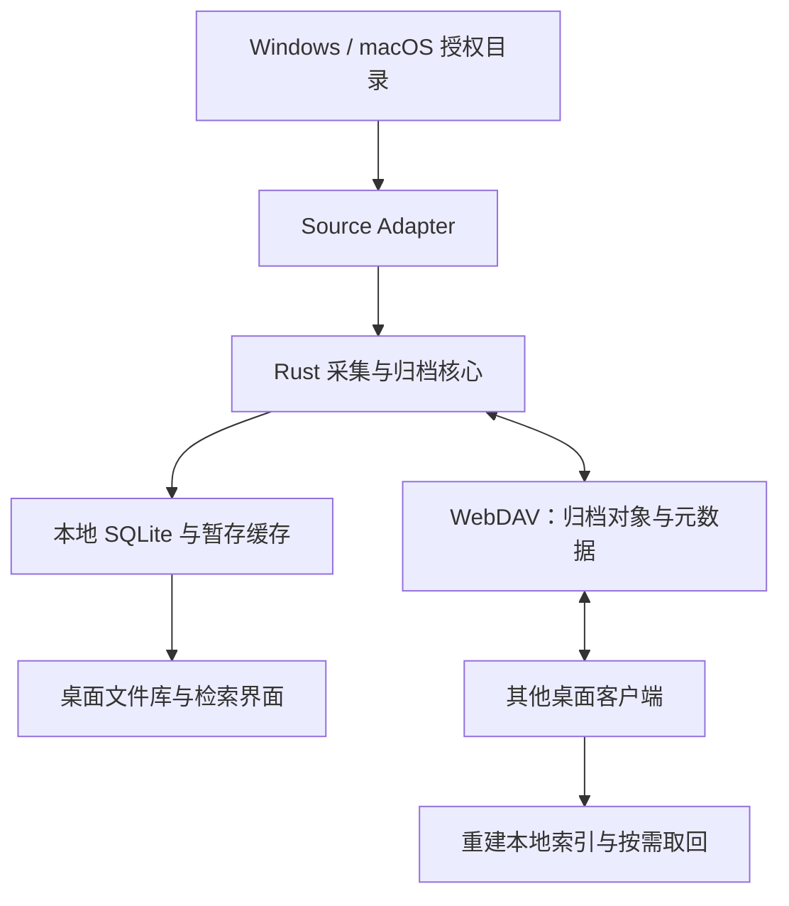

# ChatVault 架构与同步设计

状态：桌面端实现基线草案；同步协议在 V0.8 发布前完成故障测试。

## 1. 总体结构



桌面客户端直接连接用户配置的 WebDAV。扫描、索引和检索在本地完成，支持离线工作；内容对象、元数据日志和快照写入 WebDAV，供其他电脑同步与恢复。

Windows 桌面端使用 Tauri `app_local_data_dir()` 管理用户资料库，数据库位于 `%LOCALAPPDATA%\com.chatvault.desktop\chatvault.db`，附件副本目录为同级 `chatvault.objects`，桌面日志位于 `logs`。数据位置不依赖安装目录或启动工作目录；桌面端以单实例运行，计划任务通过同目录分发的 CLI 和显式 `--db` 路径访问同一资料库。安装及卸载行为见 [Windows 安装与发布](Windows安装与发布.md)。

## 2. 模块边界与建议目录

```text
apps/
  desktop/             Tauri + Vue 桌面端
crates/
  core/                业务编排与公共领域类型
  scanner/             遍历、稳定性检测与定时补偿扫描
  metadata/            对象、来源、事件及版本约束
  index/               SQLite、查询与结构初始化
  sync/                日志发布、拉取、合并、恢复
  webdav/              远端协议实现与能力探测
  cli/                 命令行验证入口
adapters/
  wechat-windows/       Windows 微信布局适配
  wechat-macos/         macOS 微信布局适配
  generic-folder/      通用文件目录扫描
packages/
  contracts/           桌面调用类型与协议样例
  ui/                  桌面界面组件
docs/
  wechat-layout/       版本样本与证据
```

模块随实施阶段建立。SourceAdapter 封装微信版本对应的目录发现和元数据提取规则；Scanner 负责统一扫描流程，增量发现采用手动触发与操作系统定时任务，不使用文件系统监听。WebDAV 模块封装连接、路径、能力探测与传输重试。Rust 核心通过明确接口供桌面壳和 CLI 调用。

### 增量扫描

扫描根在 `scan_roots` 表保存 `last_scan_started_ms` 检查点（写入本轮开始时刻，避免漏扫扫描期间新建的文件）。

| 场景 | 行为 |
| --- | --- |
| 首次扫描（无检查点） | 全量发现 |
| 桌面勾选「强制全量」/ CLI `--full` | 忽略检查点全量发现 |
| 计划任务 / 默认扫描 | 增量 |

增量发现由来源策略和已知文件复检两部分组成，来源适配器负责选择策略：

1. **通用目录**：使用完整遍历策略，不依赖父目录 mtime；对 `local_files` 中路径做磁盘 re-stat，mtime/size/缓存缺失变化的重新入库。
2. **微信 4.x**：扫描根为 `msg/file`，使用固定布局策略，仅在深度 1 的 `YYYY-MM` 月份目录上按 mtime 裁剪；月份目录变化时继续遍历其内容，再由已知文件复检覆盖文件内容变化。若文件位于 `YYYY-MM/<conversation_id>/` 稳定聊天子目录下，适配器将该目录名写入 `source_conversation_id`；标准平铺文件仍保持未知。
3. **全量扫描**：忽略检查点，所有来源均完整遍历。

编排层先用 `path_is_current` 跳过未变更文件，仅对候选变更文件做 50ms 稳定性检测，避免对全量文件串行 sleep。

微信 4.x 策略依赖固定布局：新增文件必须落在 `msg/file/YYYY-MM` 目录中，并由该月份目录的 mtime 反映变化。若后续发现版本改变目录层级，应新增对应来源策略，而不是修改通用目录策略。

## 3. 数据模型

| 实体 | 关键字段 | 规则 |
| --- | --- | --- |
| Vault | vault_id、format_version、hash_algorithm | 单次绑定一个 Vault，写入前校验格式版本 |
| FileObject | object_id、hash、size、mime、extension | object_id 包含算法和完整哈希，唯一键去重 |
| FileRecord | record_id、object_id、source_type、source_account_id、source_conversation_id、original_name、file_time、time_source、discovered_at、device_id | 一份内容可有多条来源；来源映射不设外键，允许记录先到、映射后补 |
| LocalFile | record_id、device_id、original_path、cache_path、size、mtime、availability | 本机路径保存在本地，按设备管理文件位置 |
| SourceAccount | source_type、source_account_id、source_name、display_name、is_favorite、updated_logical_clock、updated_device_id、updated_event_id | `(source_type, source_account_id)` 联合主键；ID 不可编辑，名称和收藏可跨设备同步 |
| SourceConversation | source_type、source_account_id、source_conversation_id、source_name、display_name、is_favorite、updated_logical_clock、updated_device_id、updated_event_id | `(source_type, source_account_id, source_conversation_id)` 联合主键；只有账号 ID 与聊天 ID 同时存在时创建 |
| JournalEvent | event_id、device_id、epoch、seq、logical_clock、schema_version、type、payload | 事件唯一；设备重建时生成新身份或 epoch |
| SyncCursor | device_id、epoch、last_contiguous_seq | 指向连续且已事务落库的事件 |
| Tag / RecordTag | tag_id、record_id、关系事件 | V1.5 定义并发增删语义后实现 |

本地数据库另设上传队列、对象位置、已应用事件、设置和快照记录表。文件修改后产生新内容对象与版本记录，旧对象保留。重复扫描通过本机发现键实现幂等；独立来源分别保留记录。

来源依据分为已验证目录规则、人工绑定和未知。界面名称按 `display_name → source_name → 来源 ID` 回退；清空自定义名称保存为 NULL。微信 4.x 仅从明确的 `YYYY-MM/<conversation_id>/` 聊天子目录提取聊天 ID；标准 `YYYY-MM/<file>` 平铺文件没有聊天信息，不把月份目录或文件名伪造成聊天 ID。

来源账号和来源聊天的用户修改分别写入 `SourceAccountUpdated`、`SourceConversationUpdated` 事件。远端应用使用 `(updated_logical_clock, updated_device_id, updated_event_id)` 的确定性版本序，映射事件不依赖文件对象上传完成。

## 4. WebDAV 格式 V1

```text
ChatVault/<vault_id>/
  config/vault.json
  objects/blake3/<前2位>/<次2位>/<完整哈希>
  journal/<device_id>/<epoch>/<seq>-<segment_hash>.jsonl
  commits/<device_id>/<epoch>/<seq>.json
  snapshots/<snapshot_id>/catalog.jsonl
  snapshots/<snapshot_id>/manifest.json
  devices/<device_id>.json
  staging/<device_id>/<upload_id>
```

内容对象采用不可变存储；原文件名和来源保存在元数据中。config 保存格式与 Vault 标识。提交标记引用日志路径、长度、哈希和事件范围；日志引用完整对象标识。各设备发布自己的事件序列，并将其他设备事件合并到本地 SQLite。

最低能力拟定为 HTTPS、认证、GET、HEAD、PUT、PROPFIND、MKCOL，以及用于暂存发布的 MOVE。连接测试验证实际服务行为，输出兼容性结果与具体失败原因。[WebDAV 协议参考](https://www.rfc-editor.org/rfc/rfc4918)。

首期上传采用整文件重试，下载 Range 能力单独探测。ETag 用于缓存和条件请求，BLAKE3 用于内容校验。认证使用服务支持的账号／应用密码，由桌面系统凭据库保管。

## 5. 发布与恢复流程

1. 检测文件大小和 mtime 稳定。小于配置阈值的文件复制到受控暂存并流式计算完整哈希；等于或超过阈值的文件仅计算哈希，上传时读取原路径。读取前后源文件变化则拒绝本次入库，等待重新扫描。
2. 将本地对象与待同步事件在事务中记录，队列重启后可继续。
3. 上传到唯一 staging 路径，回读复算哈希，校验通过后 MOVE 到内容地址；目标已存在时校验一致再复用，内容差异作为异常处理。
4. 确认最终目标可读且匹配预期，再上传不可变日志分片并校验。
5. 最后发布提交标记。读取方消费有效标记，校验分片与引用对象就绪情况，再以 SQLite 事务幂等应用。
6. 连续事件应用成功后推进游标；遇缺口、损坏或引用未就绪时保持原游标，记录原因并重试。

提交标记建立跨文件发布顺序；各服务的 MOVE 行为通过兼容性测试确认。多次上传、重放、乱序和崩溃恢复应收敛为相同逻辑状态。

上传和远端校验分别展示进度。完整回读并确认哈希一致后，任务进入“已校验”状态；带宽统计包含上传与回读流量。

## 6. 冲突、删除与快照

- 新记录采用全局唯一 ID；对象以内容地址去重。
- 元数据字段冲突采用 Lamport 逻辑时钟＋device_id＋event_id 确定性排序，并保留事件历史。
- 删除采用 tombstone，同一记录的删除优先于普通更新；恢复通过明确引用删除事件的 restore 操作完成。
- 首期保留对象和日志，软删除记录可通过事件恢复。
- 快照包含完整元数据、删除状态、冲突排序信息和各设备连续游标。快照文件与 manifest 校验通过后用于恢复，原日志提供回退路径。
- 新设备先导入有效快照，再拉取游标之后的日志；首次建库可直接从日志重放，索引完成后展示可查询记录数。

## 7. 状态与查询

处理状态：DISCOVERED → STABLE → HASHED → QUEUED → UPLOADING → VERIFYING → BACKED_UP；异常独立记录 RETRYABLE_FAILED、MISSING、CORRUPTED、INCOMPATIBLE。

位置状态表示 LOCAL_ONLY、REMOTE_ONLY、BOTH，与任务进度分别展示。源文件消失时更新本地可用性，远端归档独立保留；已入暂存的任务继续处理。

文件名搜索采用 SQLite FTS5，P0 验证中文分词策略。候选采用 trigram 支持子串检索，少于三个字符的查询配合受限过滤与回退匹配，分别记录单字、双字和长词查询结果及性能。[SQLite FTS5 官方文档](https://sqlite.org/fts5.html)。

结构字段使用普通索引；查询参数化、排序项白名单和页大小限制共同控制查询开销。扫描、哈希和上传通过独立队列运行，界面按批次更新检索结果。

## 8. 凭据、缓存与诊断

WebDAV 凭据使用 Windows Credential Manager／macOS Keychain 保存。同步数据采用显式字段白名单，日志记录对象 ID、处理阶段和错误码，文件名与路径按需脱敏。

远端连接使用 HTTPS 并校验证书，绑定用户配置的 Vault 根目录，校验请求路径及重定向目标。

本地副本采用以下配置（设置页持久化至本机 SQLite，桌面与 CLI 共用）：

| 设置键 | 默认值 | 含义 |
| --- | --- | --- |
| `copy_threshold_mib` | 100 | 仅小于阈值的文件建立副本；0 禁用复制；调整适用于后续入库 |
| `cache_retention_days` | 7 | 从该内容所有上传任务最近的完成时间计时，满足回收条件后删除过期副本；0 立即回收 |
| `cache_max_mib` | 1024 | 受控对象目录容量目标，超量优先回收较早完成归档的副本；0 立即回收 |

单位 MiB = 1024 × 1024 字节。配置必须为非负 32 位整数。

回收要求同内容所有本机引用对应的任务均为 `backed_up`，并且每条入库事件已被相应设备及 epoch 的同步游标覆盖。排队、失败、缺失、暂停、尚未发布元数据的任务均保护副本，因此容量是软目标，不能为满足容量删除待上传内容。保存设置、执行归档前、发布元数据完成或确认无待发布事件时检查回收；应用未运行时不主动清理。

回收仅删除受控对象目录内的哈希命名普通文件，不跟随符号链接，不删除原始附件或远端数据。无引用的哈希对象也按保留时间（文件修改时间）与容量回收，未知文件和临时文件不自动删除。入库复制与引用写入、回收操作共用数据库写锁，避免刚复制尚未建引用的内容被删除。删除副本后清空 `cache_path`；增量扫描允许无副本的已索引记录跳过，避免重复复制。

上传有副本时严格使用副本，副本缺失或损坏报错；无副本时读取原路径，上传前必须匹配入库哈希，上传后的远端回读校验继续保留。未复制的大文件若在排队期间被覆盖或删除，无法保全旧版本，任务报告来源缺失或哈希不匹配，需恢复原内容后重试或重新扫描新版本。

预览 HTML／SVG 等主动内容采用隔离展示或系统打开。V1 文件和元数据以明文存放于用户选择的 WebDAV，通过 HTTPS 传输，存储访问权限由该 WebDAV 服务管理。
