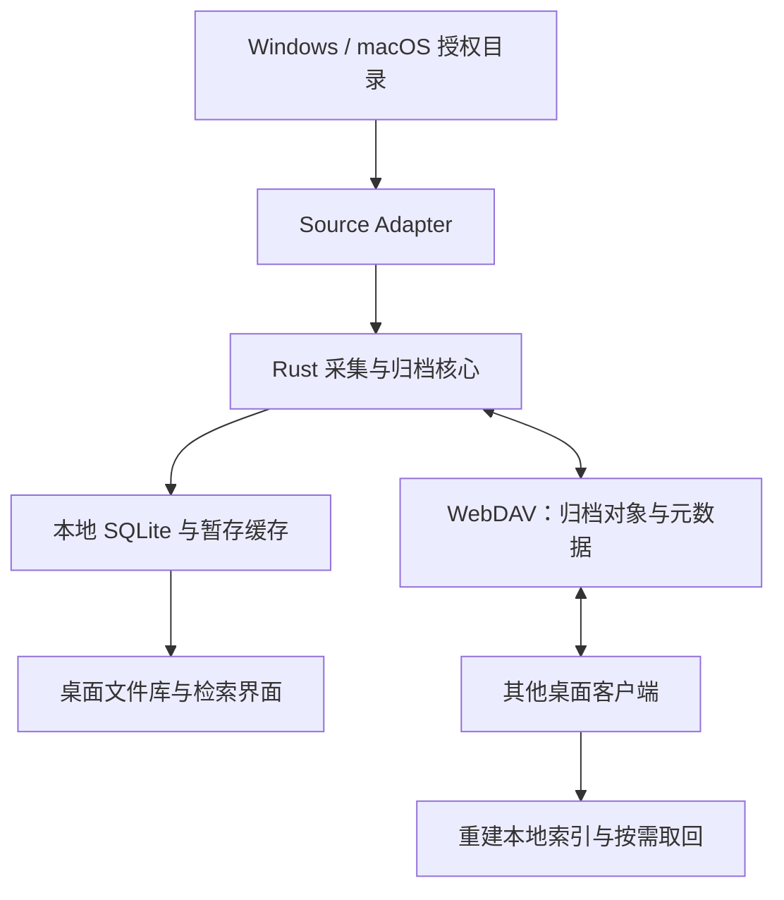
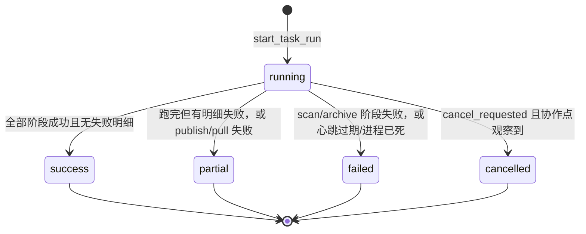
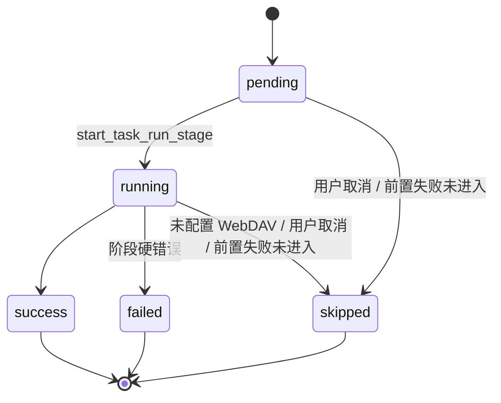
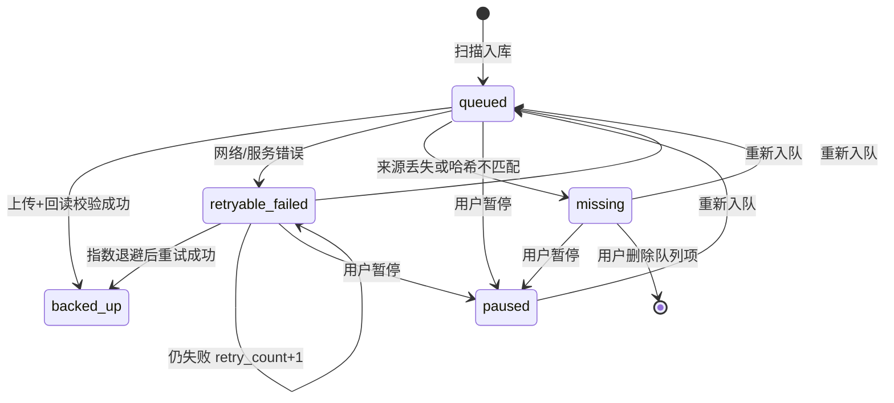

# ChatVault 架构与同步设计

状态：Windows 桌面实现基线（发布准备）；同步协议已按本节落地，发布前仍需完成真实 WebDAV 环境与换机恢复验收。

## 1. 总体结构



桌面客户端直接连接用户配置的 WebDAV。扫描、索引和检索在本地完成，支持离线工作；内容对象、元数据日志和快照写入 WebDAV，供其他电脑同步与恢复。

Windows 桌面端使用 Tauri `app_local_data_dir()` 管理用户资料库，数据库位于 `%LOCALAPPDATA%\com.chatvault.desktop\chatvault.db`，附件副本目录为同级 `chatvault.objects`，桌面日志位于 `logs`。数据位置不依赖安装目录或启动工作目录；桌面端以单实例运行，计划任务通过同目录分发的 CLI 和显式 `--db` 路径访问同一资料库。安装及卸载行为见 [Windows 安装与发布](Windows安装与发布.md)。

媒体扩展已实施：视频 mp4 备份见[微信 4.x 媒体备份完整方案](compose/spec/wechat-4x-media-backup.md)。视频按独立媒体根（`msg/video`）增量扫描；采集源可通过 `enable_videos` 关闭视频识别。聊天图片解密备份已移除。

## 2. 模块边界与建议目录

```text
apps/
  desktop/             Tauri + Vue 桌面端（前端在 src/，宿主在 src-tauri/）
crates/
  core/                业务编排与公共领域类型
  scanner/             遍历、稳定性检测与定时补偿扫描
  metadata/            对象、来源、事件及版本约束
  index/               SQLite、查询与结构初始化
  scan/                采集源扫描编排（桌面与 CLI 共用）
  sync/                日志发布、拉取、合并、恢复
  webdav/              远端协议实现与能力探测
  cli/                 命令行验证与计划任务入口
adapters/
  wechat-windows/      Windows 微信 4.x 目录/账号/附件与媒体适配
  wxwork-windows/      Windows 企业微信 Cache/File 与 Cache/Video 适配
  generic-folder/      通用文件目录扫描
docs/
  compose/spec/        已实现功能的结论性契约（历史规格，以主文档与代码为准）
```

macOS 适配目录（如 `adapters/wechat-macos/`）与独立 `packages/` 前端共享包尚未建立，属后续阶段。

SourceAdapter 封装来源对应的目录发现和元数据提取规则（附件与视频媒体根）；Scanner 负责统一扫描流程，增量发现采用手动触发与操作系统定时任务，不使用文件系统监听。WebDAV 模块封装连接、路径、能力探测与传输重试。Rust 核心通过明确接口供桌面壳和 CLI 调用。

### 增量扫描

扫描根在 `scan_roots` 表保存 `last_scan_started_ms` 检查点（写入本轮开始时刻，避免漏扫扫描期间新建的文件）。

| 场景 | 行为 |
| --- | --- |
| 首次扫描（无检查点） | 全量发现 |
| 桌面勾选「强制全量」/ CLI `--full` | 忽略检查点全量发现 |
| 计划任务 / 默认扫描 | 增量 |

增量发现由来源策略和已知文件复检两部分组成。扫描编排统一在 `crates/scan`（`chatvault-scan`），桌面与 CLI 共用，来源适配器负责选择策略：

1. **通用目录**：使用完整遍历策略，不依赖父目录 mtime；对 `local_files` 中路径做磁盘 re-stat，mtime/size/缓存缺失变化的重新入库。
2. **微信 4.x 文件**：扫描根为 `msg/file`，使用固定布局策略，仅在深度 1 的 `YYYY-MM` 月份目录上按 mtime 裁剪；月份目录变化时继续遍历其内容，再由已知文件复检覆盖文件内容变化。若文件位于 `YYYY-MM/<conversation_id>/` 稳定聊天子目录下，适配器将该目录名写入 `source_conversation_id`；标准平铺文件仍保持未知。
3. **微信 4.x 视频**：扫描根为 `msg/video`，仅当采集源 `enable_videos` 为 true 时执行；关闭时跳过该媒体根。
4. **企业微信文件/视频**：`Cache/File` 与 `Cache/Video`，月份 mtime 裁剪；跳过 `Temp`；会话 ID 不解析。详见[企业微信适配](compose/spec/wxwork-windows-adapter.md)。
5. **全量扫描**：忽略检查点，所有来源均完整遍历。

编排层先用 `path_is_current` 跳过未变更文件，仅对候选变更文件做 50ms 稳定性检测，避免对全量文件串行 sleep。

微信 4.x / 企业微信策略依赖固定布局：新增文件必须落在月份目录中，并由该月份目录的 mtime 反映变化。若后续发现版本改变目录层级，应新增对应来源策略，而不是修改通用目录策略。

## 3. 数据模型

| 实体 | 关键字段 | 规则 |
| --- | --- | --- |
| Vault | vault_id、format_version、hash_algorithm | vault_id 固定为 `chatvault-xxxx`；单次绑定一个 Vault，写入前校验格式版本 |
| FileObject | object_id、hash、size、mime、extension | object_id 包含算法和完整哈希，唯一键去重 |
| FileRecord | record_id、object_id、source_type、source_account_id、source_conversation_id、original_name、file_time、time_source、discovered_at、device_id | 一份内容可有多条来源；来源映射不设外键，允许记录先到、映射后补 |
| LocalFile | record_id、device_id、original_path、cache_path、size、mtime、availability | 本机路径保存在本地，按设备管理文件位置 |
| SourceAccount | source_type、source_account_id、source_name、display_name、is_favorite、updated_logical_clock、updated_device_id、updated_event_id | `(source_type, source_account_id)` 联合主键；ID 不可编辑，名称和收藏可跨设备同步 |
| SourceConversation | source_type、source_account_id、source_conversation_id、source_name、display_name、is_favorite、updated_logical_clock、updated_device_id、updated_event_id | `(source_type, source_account_id, source_conversation_id)` 联合主键；只有账号 ID 与聊天 ID 同时存在时创建 |
| JournalEvent | event_id、device_id、epoch、seq、logical_clock、schema_version、type、payload | 事件唯一；设备重建时生成新身份或 epoch |
| DeviceInfo | device_id、display_name、epoch、last_seq、updated_at | device_id 由系统生成；display_name 为可配置设备名称，随注册文件同步 |
| SyncCursor | device_id、epoch、last_contiguous_seq | 指向连续且已事务落库的事件 |
| Tag / RecordTag | tag_id、record_id、关系事件 | V1.5 定义并发增删语义后实现 |

本地数据库另设上传队列、对象位置、已应用事件、设置和快照记录表。文件修改后产生新内容对象与版本记录，旧对象保留。重复扫描通过本机发现键实现幂等；独立来源分别保留记录。

来源依据分为已验证目录规则、人工绑定和未知。界面名称按 `display_name → source_name → 来源 ID` 回退；清空自定义名称保存为 NULL。微信 4.x 仅从明确的 `YYYY-MM/<conversation_id>/` 聊天子目录提取聊天 ID；标准 `YYYY-MM/<file>` 平铺文件没有聊天信息，不把月份目录或文件名伪造成聊天 ID。

来源账号和来源聊天的用户修改分别写入 `SourceAccountUpdated`、`SourceConversationUpdated` 事件。远端应用使用 `(updated_logical_clock, updated_device_id, updated_event_id)` 的确定性版本序，映射事件不依赖文件对象上传完成。

## 4. WebDAV 格式 V1

```text
chatvault-xxxx/                 # xxxx 为用户可配置后缀；不再叠加 ChatVault/ 父目录
  config/vault.json
  objects/blake3/<前2位>/<次2位>/<完整哈希>
  journal/<device_id>/<epoch>/<seq>-<segment_hash>.jsonl
  commits/<device_id>/<epoch>/<seq>.json
  snapshots/<snapshot_id>/catalog.jsonl
  snapshots/<snapshot_id>/manifest.json
  devices/<device_id>.json
  staging/<device_id>/<upload_id>
```

内容对象采用不可变存储；原文件名和来源保存在元数据中。config 保存格式与 Vault 标识。提交标记引用日志路径、长度、哈希和事件范围；日志引用完整对象标识。各设备发布自己的事件序列，并将其他设备事件合并到本地 SQLite。

最低能力拟定为 HTTPS、认证、GET、HEAD、PUT、PROPFIND、MKCOL，以及用于暂存发布的 MOVE。连接测试验证实际服务行为，输出兼容性结果与具体失败原因。[WebDAV 协议参考](https://www.rfc-editor.org/rfc/rfc4918)。

首期上传采用整文件重试，下载 Range 能力单独探测。ETag 用于缓存和条件请求，BLAKE3 用于内容校验。认证使用服务支持的账号／应用密码，由桌面系统凭据库保管。

## 5. 发布与恢复流程

1. 检测文件大小和 mtime 稳定。小于配置阈值的文件复制到受控暂存并流式计算完整哈希；等于或超过阈值的文件仅计算哈希，上传时读取原路径。读取前后源文件变化则拒绝本次入库，等待重新扫描。
2. 将本地对象与待同步事件在事务中记录，队列重启后可继续。
3. 上传到唯一 staging 路径，回读复算哈希，校验通过后 MOVE 到内容地址；目标已存在时校验一致再复用，内容差异作为异常处理。
4. 归档已完整回读并标记 `backed_up` 后，发布/拉取对引用对象统一做 HEAD 存在性/大小门禁（无 Content-Length 时降级完整回读），再上传或应用日志。内容哈希在真正下载使用时校验。
5. 最后发布提交标记。读取方消费有效标记，校验分片与引用对象就绪情况，再以 SQLite 事务幂等应用。
6. 连续事件应用成功后推进游标；遇缺口、损坏或引用未就绪时保持原游标，记录原因并重试。

提交标记建立跨文件发布顺序；各服务的 MOVE 行为通过兼容性测试确认。多次上传、重放、乱序和崩溃恢复应收敛为相同逻辑状态。

上传和远端校验分别展示进度。完整回读并确认哈希一致后，任务进入“已校验”状态；带宽统计包含上传与回读流量。

### 5.1 任务运行与归档队列

#### 5.1.1 术语（全库唯一）

| 正式名 | 代码/表 | 含义 |
| --- | --- | --- |
| **运行** | `task_runs` | 一次手动或定时执行（扫描→归档→发布→拉取） |
| **阶段** | `task_run_stages` | 运行内的 scan / archive / publish / pull |
| **运行明细** | `task_run_items` | 本次运行中的异常文件（成功只进阶段计数） |
| **归档单元** | `upload_tasks` | 跨运行的单文件归档队列项 |
| **系统计划任务** | schtasks `ChatVaultScheduledScan` | OS 层拉起 CLI（经 PowerShell Hidden 包装避免控制台弹窗），不是业务对象 |

UI 与文档禁止把「运行」「归档单元」「系统计划任务」统称为「任务」。

#### 5.1.2 运行

一次「立即运行 / 定时运行」对应一条 `task_runs`。

- **类型** `kind`：`pipeline`（主路径）| `restore`（从远端重建索引，当前 CLI/桌面 restore 尚未写入运行记录）。
- **触发** `trigger_source`：`manual`（桌面立即运行）| `schedule`（系统计划任务拉起 CLI）。
- **执行方** `runner_kind`：`desktop` | `cli`；`runner_pid` 记录进程；`heartbeat_at` 为最近进度时间。
- **摘要** `summary_json`：桌面与定时 CLI 统一使用 `scan`、`archive` 嵌套统计；新文件数为 `scan.newObjects`（内容对象数），上传数为 `archive.uploaded`。定时运行由阶段统计生成摘要，取消和同步失败时保留已完成阶段的计数；配置或扫描错误也会结束运行并保存原因。运行中尚无摘要时显示“执行中”，结束后缺失统计时明确显示状态。
- **定时日志**：CLI 将执行程序、数据库路径、运行 ID、采集事件、阶段结果及顶层错误写入数据库同级 `logs/scheduled-YYYY-MM-DD.log`，按 UTC 日期追加并保留最近七天；不记录凭据。命令失败返回非零退出码。



- **partial** 语义：流水线逻辑跑完但存在失败明细，或发布/拉取失败（scan/archive 成果保留）。
- **cancelled**：用户请求结束；已 success 的阶段保留，当前/未开始阶段标 `skipped`；`upload_tasks` 状态不变，待下次运行继续。
- **崩溃清扫**：启动时仅将「`running` 且心跳为空或超过 60 秒」标为 `failed`，避免误杀正在跑的桌面/CLI。保留最近 50 次或 30 天运行。

#### 5.1.3 阶段

固定顺序 `scan → archive → publish → pull`；同 run 同 stage 幂等（`UNIQUE(run_id, stage)`）。



阶段级硬失败：`scan`/`archive` 失败则整 run `failed`；`publish`/`pull` 失败则 run `partial`。

#### 5.1.4 运行明细

成功文件不落明细。状态：`failed`（可重试）| `missing`（来源丢失/哈希不匹配）| `skipped`。明细可带 `task_id` 指向归档单元，用于重新入队。

#### 5.1.5 归档单元

`upload_tasks` 为跨运行上传队列；扫描入库时创建。



- 可执行条件：`queued`，或 `retryable_failed` 且已过退避窗口 `min(3600, 30 × 2^(retry_count-1))` 秒。
- 「重新入队」只改状态，不立刻上传；真正上传由下次运行完成。
- 「本地缺失」项可确认后删除；后端按当前 `missing` 状态原子校验并删除队列项，状态已变化或任务不存在时拒绝操作。文件库记录、原文件、缓存和远端归档保留，运行历史保留但移除该任务的重试关联；已删除任务不能通过旧页面重新入队。
- 概念处理态 `UPLOADING`/`VERIFYING` **不入库**，存在于单次归档调用内（见 §7）。

#### 5.1.6 进度可见性与取消

- 桌面与 CLI 共用同一 SQLite。两者均通过 `DbProgressSink` 节流写入阶段 stats 与 `heartbeat_at`。
- 桌面本机运行额外推送 Tauri 事件（`run://started|stage|progress|item|finished`）；CLI 不推送事件，桌面通过运行监视器轮询 DB（约 2s）展示任意 `running` 运行。
- **取消**：对 `status='running'` 的运行写 `cancel_requested=1`（桌面与 CLI 运行均可）。执行方在阶段边界、archive 逐文件、scan 采集源边界等协作点读取标志并结束为 `cancelled`。不 kill 进程。

#### 5.1.7 与 Vault 切换

切换 Vault 前必须先在设置页执行「清空旧 Vault 绑定」：解除 `remote_binding`，清除同步游标、本机日志、已应用事件与设备注册，并将归档单元重新排队。本地文件索引与来源映射保留。操作需输入当前完整 Vault ID 强制确认。

## 6. 冲突、删除与快照

- 新记录采用全局唯一 ID；对象以内容地址去重。
- 元数据字段冲突采用 Lamport 逻辑时钟＋device_id＋event_id 确定性排序，并保留事件历史。
- 删除采用 tombstone，同一记录的删除优先于普通更新；恢复通过明确引用删除事件的 restore 操作完成。
- 文件库支持对象级可见性：`ObjectHidden` / `ObjectRestored` / `ObjectPurged`。隐藏可恢复且不中断备份；彻底删除仅允许从隐藏态进入，移除本机索引并尝试删除远端对象；同内容可在源文件仍存在时经新记录重新入库（见 `docs/compose/spec/library-hide-delete.md`）。
- 首期保留对象和日志，软删除记录可通过事件恢复。
- 快照包含完整元数据、删除状态、冲突排序信息和各设备连续游标。快照文件与 manifest 校验通过后用于恢复，原日志提供回退路径。
- 新设备先导入有效快照，再拉取游标之后的日志；首次建库可直接从日志重放，索引完成后展示可查询记录数。

## 7. 状态与查询

入库与归档的概念处理态：DISCOVERED → STABLE → HASHED → QUEUED → UPLOADING → VERIFYING → BACKED_UP；异常独立记录 RETRYABLE_FAILED、MISSING、CORRUPTED、INCOMPATIBLE。其中 `QUEUED`/`BACKED_UP`/`RETRYABLE_FAILED`/`MISSING` 对应归档单元持久状态（§5.1.5）；`UPLOADING`/`VERIFYING` 不落库，仅存在于单次归档调用内。

位置状态表示 LOCAL_ONLY、REMOTE_ONLY、BOTH，与任务进度分别展示。源文件消失时更新本地可用性，远端归档独立保留；已入暂存的任务继续处理。文件库列表按内容对象折叠展示，**详情侧栏**查看全部来源（支持时间字段/位置/扩展名筛选、排序与总数）；每行展示本地/远程/本地+远程/失效徽章，可对本机路径直接打开或定位，对仅远程对象下载到 `download_dir`；支持多选批量导出、释放缓存、删除本机原文件，以及隐藏/恢复/彻底删除（多端同步，见 `docs/compose/spec/library-hide-delete.md`）。

文件名搜索采用 SQLite FTS5，P0 验证中文分词策略。候选采用 trigram 支持子串检索，少于三个字符的查询配合受限过滤与回退匹配，分别记录单字、双字和长词查询结果及性能。[SQLite FTS5 官方文档](https://sqlite.org/fts5.html)。

结构字段使用普通索引；查询参数化、排序项白名单和页大小限制共同控制查询开销。扫描、哈希和上传通过独立队列运行，界面按批次更新检索结果。

## 8. 凭据、缓存与诊断

WebDAV 凭据使用 Windows Credential Manager／macOS Keychain 保存。同步数据采用显式字段白名单，日志记录对象 ID、处理阶段和错误码，文件名与路径按需脱敏。

远端连接使用 HTTPS 并校验证书，绑定用户配置的 Vault 根目录，校验请求路径及重定向目标。

本地副本采用以下配置（设置页持久化至本机 SQLite，桌面与 CLI 共用）：

| 设置键 | 默认值 | 含义 |
| --- | --- | --- |
| `copy_threshold_mib` | 100 | 仅小于阈值的文件建立副本；0 禁用复制；调整适用于后续入库 |
| `cache_retention_days` | 7 | 从该内容所有上传任务最近的完成时间计时，满足回收条件后删除过期副本；0 立即回收 |
| `cache_max_mib` | 1024 | 受控对象目录容量目标，超量优先回收较早完成归档的副本；0 立即回收 |
| `download_dir` | （空） | 文件库「下载」落点；空表示 `%USERPROFILE%\Downloads\ChatVault`。下载是用户目录导出副本，不写入 `local_files` |

单位 MiB = 1024 × 1024 字节。配置必须为非负 32 位整数。

回收要求同内容所有本机引用对应的任务均为 `backed_up`，并且每条入库事件已被相应设备及 epoch 的同步游标覆盖。排队、失败、缺失、暂停、尚未发布元数据的任务均保护副本，因此容量是软目标，不能为满足容量删除待上传内容。保存设置、执行归档前、发布元数据完成或确认无待发布事件时检查回收；应用未运行时不主动清理。

回收仅删除受控对象目录内的哈希命名普通文件，不跟随符号链接，不删除原始附件或远端数据。无引用的哈希对象也按保留时间（文件修改时间）与容量回收，未知文件和临时文件不自动删除。入库复制与引用写入、回收操作共用数据库写锁，避免刚复制尚未建引用的内容被删除。删除副本后清空 `cache_path`；增量扫描允许无副本的已索引记录跳过，避免重复复制。

上传有副本时严格使用副本，副本缺失或损坏报错；无副本时读取原路径，上传前必须匹配入库哈希，上传后的远端回读校验继续保留。未复制的大文件若在排队期间被覆盖或删除，无法保全旧版本，任务报告来源缺失或哈希不匹配，需恢复原内容后重试或重新扫描新版本。

预览 HTML／SVG 等主动内容采用隔离展示或系统打开。V1 文件和元数据以明文存放于用户选择的 WebDAV，通过 HTTPS 传输，存储访问权限由该 WebDAV 服务管理。
